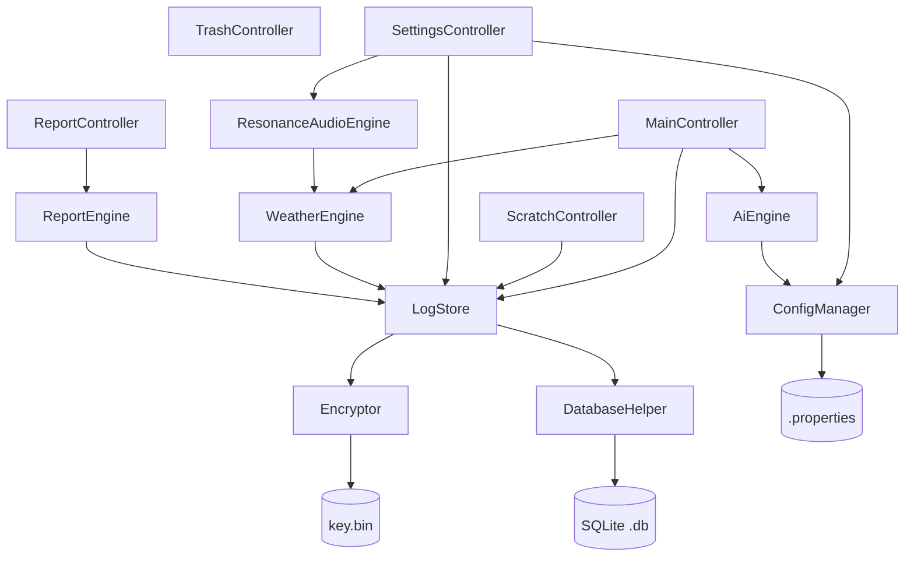
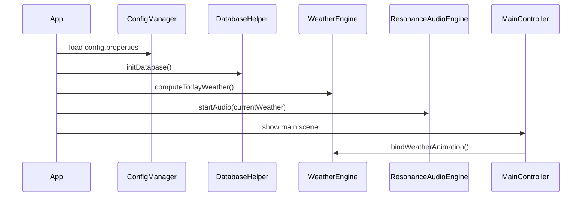

# MindEcho「智愈心海」技术设计文档

## Overview

MindEcho 是一款面向 Windows 平台的轻量化桌面情绪解压工具，以「倾诉即销毁，回望皆释然」为核心理念。用户通过情绪粉碎机自由倾诉，系统触发粉碎动画并返回 AI 情绪回应，倾诉原文经 AES-256-GCM 加密后落盘，所有数据仅存本机。

**技术栈汇总**

| 层次 | 选型 |
|------|------|
| 桌面 UI 框架 | JavaFX 21 + FXML |
| 构建 | Maven |
| AI 调用 | OkHttp 4.x + Gson 2.x → OpenAI Chat Completions API |
| 加密 | javax.crypto AES-256-GCM |
| 持久化 | SQLite（sqlite-jdbc 驱动） |
| 图表渲染 | JavaFX Canvas（自绘） |
| 截图导出 | JavaFX WritableImage → javax.imageio PNG |
| 音频播放 | JavaFX MediaPlayer |
| 配置 | .properties 本地文件 |
| 打包 | jpackage（独立 .exe 捆绑 JRE） |
| 平台 | Windows 10+ (x64) |

**设计目标**

- 零网络依赖可用：API 不可达时本地备用话术无缝兜底
- 隐私优先：原文明文不接触磁盘，密钥本地保管
- 模块解耦：Controller 层只依赖 Service 接口，方便单元测试与日后扩展
- 双击即用：jpackage 打包，无需用户安装 JRE

---

## Architecture

### 整体分层架构

```
┌─────────────────────────────────────────────────────────────┐
│                        表现层（UI Layer）                    │
│  JavaFX FXML + Controller                                   │
│  MainController │ ScratchController │ ReportController      │
│  TrashController │ SettingsController                       │
└──────────────┬──────────────────────────────────────────────┘
               │ 调用 Service 接口
┌──────────────▼──────────────────────────────────────────────┐
│                       服务层（Service Layer）                │
│  AiEngine │ Encryptor │ LogStore │ WeatherEngine            │
│  ResonanceAudioEngine │ ReportEngine                        │
└──────────┬──────────────────────┬───────────────────────────┘
           │ 使用 Model           │ 使用 Util
┌──────────▼──────────┐  ┌────────▼───────────────────────────┐
│   模型层（Model）    │  │          工具层（Util）             │
│  DestructionLog     │  │  DatabaseHelper │ ConfigManager    │
│  EmotionLabel       │  └────────────────────────────────────┘
│  AiStyle            │
│  EmotionWeather     │
└─────────────────────┘
```

### 关键设计决策

1. **单例 Service**：所有 Service 组件以单例形式通过 `ServiceLocator`（简单工厂）管理，避免 Controller 持有多个 Service 实例导致状态不一致。
2. **异步 AI 调用**：AiEngine 的 OpenAI 调用在 JavaFX `Task<AiResponse>` 中执行，结果通过 `Platform.runLater()` 回调至 UI 线程，保证界面不卡顿。
3. **观察者联动**：LogStore 写入成功后通过 `EmotionEventBus`（基于 JavaFX `ObjectProperty`）广播情绪变化事件，WeatherEngine 与 ResonanceAudioEngine 订阅该事件实现自动联动，无需 Controller 手动协调。
4. **备用话术库懒加载**：`fallback_phrases.json` 在 AiEngine 首次 fallback 时一次性解析缓存至内存，后续直接从内存随机取。

### 模块依赖图（Mermaid）



### 启动流程



---

## Components and Interfaces

### 2.1 AiEngine

**职责**：调用 OpenAI Chat Completions API 或本地备用话术库，返回带情绪标签与风格的 AI 回应。

```java
public interface AiEngineService {
    /**
     * 异步生成 AI 回应。
     * @param text    用户倾诉原文（明文，仅在内存中使用，不落盘）
     * @param callback 结果回调，在 JavaFX Application Thread 执行
     */
    void generateResponseAsync(String text, Consumer<AiResponse> callback);
}

/** AI 回应值对象 */
public record AiResponse(
    String responseText,   // 15~40 字中文回应
    AiStyle style,         // GENTLE | SHARP
    EmotionLabel emotion   // ANGER | ANXIETY | SADNESS | CALM
) {}
```

**实现策略**：

- 随机选取 `AiStyle`（Math.random() < 0.5 → GENTLE，否则 SHARP）
- 构造 System Prompt 指定风格与字数约束，User Prompt 为倾诉原文
- OkHttp 发起 POST 请求，设置 `connectTimeout(10, SECONDS)` + `readTimeout(10, SECONDS)`
- 解析 Gson `JsonObject` 取 `choices[0].message.content`
- 情绪标签从 API 响应的额外字段或通过关键词规则解析（见 EmotionClassifier）
- 任何异常走 `FallbackPhraseStore.getRandom(style)`

**EmotionClassifier 关键词规则**（当 API 未返回情绪字段时使用）：

| 关键词集合 | → EmotionLabel |
|-----------|---------------|
| 愤怒、气死、烦透、滚、去死 | ANGER |
| 焦虑、担心、睡不着、不安、压力 | ANXIETY |
| 难过、委屈、哭、伤心、失落 | SADNESS |
| 其他 / 无命中 | CALM |

### 2.2 Encryptor

**职责**：AES-256-GCM 加解密，密钥管理。

```java
public class Encryptor {
    /** 加密，每次生成随机 12 字节 IV，返回 IV + 密文 + GCM Tag 拼接 */
    public byte[] encrypt(String plaintext) throws EncryptionException;

    /** 解密，从字节数组中提取 IV，返回原文字符串 */
    public String decrypt(byte[] cipherData) throws DecryptionException;

    /** 懒加载密钥：从 %APPDATA%/MindEcho/key.bin 读取；不存在则生成 32 字节随机密钥并持久化 */
    private SecretKey loadOrGenerateKey();
}
```

**加密数据格式**（字节布局）：

```
[0..11]  IV (12 bytes, GCM nonce)
[12..N]  AES-GCM ciphertext + 16-byte auth tag
```

### 2.3 LogStore

**职责**：SQLite 日志 CRUD，包装加密/解密调用。

```java
public interface LogStoreService {
    /** 写入一条销毁日志（原文加密后存储） */
    void save(DestructionLog log) throws StorageException;

    /** 查询某自然日的全部日志（不含原文） */
    List<DestructionLog> findByDate(LocalDate date);

    /** 查询某自然月的全部日志 */
    List<DestructionLog> findByMonth(YearMonth month);

    /** 随机抽取一条历史日志（用于刮刮乐） */
    Optional<DestructionLog> findRandom();

    /** 清空全部日志 */
    void deleteAll() throws StorageException;

    /** 查询全部日志总数 */
    int countAll();
}
```

### 2.4 WeatherEngine

**职责**：根据当日情绪标签分布计算 `EmotionWeather`。

```java
public class WeatherEngine {
    /**
     * 输入当日情绪标签列表，输出天气类型。
     * 规则（优先级从高到低）：
     *   1. ANGER 占比 > 40% → THUNDERSTORM
     *   2. ANXIETY 为最高频标签（且不满足规则1）→ CLOUDY
     *   3. SADNESS 存在（且不满足规则1、2）→ RAINY
     *   4. 其余 → SUNNY
     * 若列表为空 → SUNNY
     */
    public EmotionWeather compute(List<EmotionLabel> todayLabels);
}
```

### 2.5 ResonanceAudioEngine

**职责**：基于 JavaFX MediaPlayer 管理情绪音场的淡入淡出切换。

```java
public class ResonanceAudioEngine {
    /** 根据天气类型切换音场（淡出当前 → 淡入新音场） */
    public void switchTo(EmotionWeather weather);

    /** 停止播放 */
    public void stop();

    /** 恢复播放当前天气对应音场 */
    public void resume(EmotionWeather currentWeather);

    /** 音场-文件映射（内部） */
    // THUNDERSTORM/ANGER → anger.mp3
    // CLOUDY/ANXIETY     → anxiety.mp3
    // RAINY/SADNESS      → sadness.mp3
    // SUNNY/CALM         → calm.mp3
}
```

**淡入淡出实现**：使用 JavaFX `Timeline` + `KeyFrame` 在 1~3 秒内线性调整 `MediaPlayer.setVolume()`，淡出至 0 后调用 `stop()`，再启动新 MediaPlayer 执行淡入。

### 2.6 ReportEngine

**职责**：聚合月度数据，生成统计报告 DTO，供 ReportController 渲染图表与导出 PNG。

```java
public class ReportEngine {
    /** 生成当月报告 DTO */
    public MonthlyReport generate(YearMonth month);
}

public record MonthlyReport(
    YearMonth month,
    List<Map.Entry<EmotionLabel, Integer>> emotionRanking,  // 按频次降序
    List<Integer> weeklyFrequency,                          // 索引0=第1周...索引N=第N周
    int gentleCount,
    int sharpCount,
    List<String> suggestions                                // 个性化建议文本列表
) {}
```

### 2.7 DatabaseHelper

```java
public class DatabaseHelper {
    private static final String DB_PATH =
        System.getenv("APPDATA") + "/MindEcho/mindecho.db";

    /** 获取单例 Connection（使用连接池或单连接 + synchronized） */
    public static Connection getConnection();

    /** 应用启动时执行 DDL，幂等 */
    public static void initDatabase();
}
```

### 2.8 ConfigManager

```java
public class ConfigManager {
    public String get(String key);
    public void set(String key, String value);
    public void save();                        // 持久化至 config.properties
    public boolean isApiKeyConfigured();
}
```

### 2.9 EmotionEventBus

```java
/**
 * 单例事件总线，基于 JavaFX ObjectProperty<EmotionLabel>。
 * LogStore 写入成功后 publish，WeatherEngine 与 ResonanceAudioEngine 订阅。
 */
public class EmotionEventBus {
    private static final EmotionEventBus INSTANCE = new EmotionEventBus();
    private final ObjectProperty<EmotionLabel> latestEmotion = new SimpleObjectProperty<>();

    public void publish(EmotionLabel label);
    public void subscribe(ChangeListener<EmotionLabel> listener);
}
```

---

## Data Models

### 4.1 实体模型：DestructionLog

```java
public class DestructionLog {
    private Long id;                     // 主键，自增
    private byte[] encryptedText;        // AES-256-GCM 密文（IV + ciphertext + tag）
    private String aiResponse;           // AI 回应明文（15~40 字）
    private EmotionLabel emotionLabel;   // 情绪标签枚举
    private AiStyle aiStyle;             // AI 风格枚举
    private LocalDateTime createdAt;     // 记录创建时间（本地时区）
}
```

### 4.2 枚举

```java
public enum EmotionLabel { ANGER, ANXIETY, SADNESS, CALM }
public enum AiStyle      { GENTLE, SHARP }
public enum EmotionWeather { THUNDERSTORM, CLOUDY, RAINY, SUNNY }
```

### 4.3 SQLite 数据库 Schema

```sql
-- 销毁日志表
CREATE TABLE IF NOT EXISTS destruction_log (
    id             INTEGER PRIMARY KEY AUTOINCREMENT,
    encrypted_text BLOB    NOT NULL,         -- IV + ciphertext + GCM tag
    ai_response    TEXT    NOT NULL,
    emotion_label  TEXT    NOT NULL,         -- 枚举名称字符串
    ai_style       TEXT    NOT NULL,         -- 枚举名称字符串
    created_at     TEXT    NOT NULL          -- ISO-8601 格式，如 "2025-01-15T14:30:00"
);

-- 刮刮乐每日次数表
CREATE TABLE IF NOT EXISTS scratch_quota (
    quota_date     TEXT    PRIMARY KEY,      -- "2025-01-15"
    remaining      INTEGER NOT NULL DEFAULT 3
);
```

### 4.4 配置文件 config.properties 结构

```properties
# OpenAI 配置
openai.api.key=
openai.model=gpt-4o-mini
openai.max_tokens=100
openai.base_url=https://api.openai.com/v1

# 应用配置
app.theme=light          # light | dark
app.audio.enabled=true

# 数据库路径（留空则使用默认 APPDATA 路径）
app.db.path=
```

### 4.5 fallback_phrases.json 结构

```json
{
  "GENTLE": [
    "你已经很努力了，这种感觉不会一直持续的。",
    "能倾诉出来就已经是在好好爱自己了。"
  ],
  "SHARP": [
    "这点事搞成这样，你也是一绝。",
    "行了行了，发泄完了继续打工吧。"
  ]
}
```

---

## 核心算法说明

### 5.1 天气类型计算算法

```
输入：List<EmotionLabel> labels（当日全部情绪标签，可为空）
输出：EmotionWeather

步骤：
1. 若 labels 为空 → 返回 SUNNY
2. 计算 total = labels.size()
3. 计算 angerCount = count(ANGER in labels)
4. 若 angerCount / total > 0.40 → 返回 THUNDERSTORM
5. 找出最高频标签 dominant = argmax(frequency)
6. 若 dominant == ANXIETY → 返回 CLOUDY
7. 若 SADNESS 在 labels 中存在（count > 0）→ 返回 RAINY
8. → 返回 SUNNY
```

### 5.2 粉碎粒子动画算法

粉碎动画在 JavaFX `AnimationTimer` 中以帧为单位更新，步骤：

1. 将 TextArea 中的文字渲染为内存 `WritableImage`
2. 按像素采样生成约 300~500 个粒子（Particle），每个粒子携带颜色、初始坐标、速度向量（随机方向，模拟爆炸散射）
3. 每帧更新粒子坐标（x += vx，y += vy + gravity * t）并线性衰减 alpha 值
4. 在 Canvas 上清屏后重绘全部粒子
5. 当所有粒子 alpha ≤ 0 或经过 3 秒后停止 AnimationTimer，回调通知 MainController 动画完成

### 5.3 刮刮乐交互算法

1. 在 Canvas 上绘制灰色遮罩层（覆盖卡片内容区域）
2. 注册 `setOnMouseDragged` 事件，使用 `GraphicsContext.clearRect()` 在鼠标轨迹周围清除像素（橡皮擦效果，半径约 20px）
3. 每次 clearRect 后计算已清除面积比例：通过 PixelReader 读取遮罩层透明像素数量 / 总遮罩像素数
4. 当已刮开面积 ≥ 80% 时，触发「刮开完成」事件，调用 LogStore 扣减当日剩余次数

### 5.4 AES-256-GCM 加解密流程

```
加密：
  1. 生成 32 字节 SecretKey（AES）
  2. 生成 12 字节随机 IV（SecureRandom）
  3. Cipher.getInstance("AES/GCM/NoPadding")
  4. cipher.init(ENCRYPT_MODE, key, new GCMParameterSpec(128, iv))
  5. cipherBytes = cipher.doFinal(plaintext.getBytes(UTF-8))
  6. 返回 iv + cipherBytes（cipherBytes 末尾含 16 字节 GCM Tag）

解密：
  1. 从字节数组提取 iv = bytes[0..11]
  2. 提取 cipherBytes = bytes[12..]
  3. cipher.init(DECRYPT_MODE, key, new GCMParameterSpec(128, iv))
  4. plainBytes = cipher.doFinal(cipherBytes)
  5. 返回 new String(plainBytes, UTF-8)
  注：密钥不匹配或密文被篡改时 doFinal 抛出 AEADBadTagException
```

---

## Correctness Properties

*属性（Property）是在系统所有合法执行中均应成立的特征或行为——本质上是关于系统应当做什么的形式化陈述。属性是人类可读规约与机器可验证正确性保证之间的桥梁。*


### 属性精简分析（Property Reflection）

在将 prework 结论转化为正式属性之前，对识别出的 PROPERTY 类条目进行冗余检查：

- **2.1（风格随机分布）**与 **2.4（fallback 非空且风格匹配）**：测试角度不同，不合并。
- **3.2（加密往返）**与 **11.1（加密往返）**：完全重叠，合并入 Requirement 11 属性。
- **5.1 与 5.2（天气计算规则）**：同一纯函数的规则定义，合并为一个属性。
- **6.1、6.5（配额约束与减少）**：逻辑上 6.5 蕴含 6.1，合并为「刮刮乐配额不变量」。
- **7.2（每周频次之和）**与 **7.3（GENTLE+SHARP 之和）**：均是一致性校验，保留两条（测试不同字段）。
- **8.3 与 8.4（垃圾桶无副作用）**：8.4 是 8.3 的扩展，合并为一条完整的「垃圾桶无副作用」属性。
- **10.2 与 10.5（配置往返）**：均是 ConfigManager 的读写往返，合并为一条。
- **11.1 与 11.2**：11.2 蕴含 11.1（若 decrypt(encrypt(s))==s 成立则往返已验证），但 11.2 额外验证 IV 随机性，保留为独立属性。
- **11.3 与 11.4**：测试不同的安全场景（错误密钥 vs 篡改密文），保留两条。

精简后共 **14 条**核心属性。

---

### Property 1: AI 回应风格随机分布

*对任意* 大量（≥ 1000 次）随机 `AiStyle` 选取操作，`GENTLE` 与 `SHARP` 各自出现的比例应均落在 40%～60% 之间，满足约 50/50 的随机分布。

**Validates: Requirements 2.1**

---

### Property 2: Fallback 话术非空且风格匹配

*对任意* `AiStyle` 枚举值（`GENTLE` 或 `SHARP`），从 `fallback_phrases.json` 备用话术库中为该风格随机选取的结果应非 null、非空字符串，且来自该风格对应的话术集合。

**Validates: Requirements 2.4**

---

### Property 3: 天气计算规则正确性

*对任意* `EmotionLabel` 列表（包含空列表），`WeatherEngine.compute()` 的返回值应严格满足四条优先级规则：① `ANGER` 占比 > 40% → `THUNDERSTORM`；② `ANXIETY` 为最高频且不满足①→ `CLOUDY`；③ `SADNESS` 存在且不满足①②→ `RAINY`；④ 其余（含空列表）→ `SUNNY`。

**Validates: Requirements 5.1, 5.2, 5.4**

---

### Property 4: 日志存储往返完整性

*对任意* 合法的 `DestructionLog` 对象（含任意 `aiResponse` 文本、任意 `EmotionLabel`、任意 `AiStyle`、任意时间戳），`LogStore.save(log)` 后通过 `findByDate(log.getCreatedAt().toLocalDate())` 应能找到该记录，且 `aiResponse`、`emotionLabel`、`aiStyle`、`createdAt` 四个字段与原对象完全一致。

**Validates: Requirements 3.3**

---

### Property 5: 全量删除后记录数归零

*对任意* 预先插入 n 条（n ≥ 0）`DestructionLog` 记录后，调用 `LogStore.deleteAll()` 后 `LogStore.countAll()` 应返回 0。

**Validates: Requirements 4.3**

---

### Property 6: 刮刮乐配额不变量

*对任意* 自然日内的刮刮乐操作序列，当日已成功完成的刮开次数不得超过 3 次，且每次成功完成后当日剩余次数应恰好减少 1（不允许超减或不减）。

**Validates: Requirements 6.1, 6.5**

---

### Property 7：随机抽取结果属于历史集合

*对任意* 非空的历史 `DestructionLog` 集合，`LogStore.findRandom()` 返回的记录应属于该集合（即返回记录的 `id` 存在于历史记录 id 集合中）。

**Validates: Requirements 6.3**

---

### Property 8：刮开内容不暴露原文

*对任意* `DestructionLog` 记录，构造供刮刮乐展示的「卡片数据」时，结果数据结构中不应包含 `encryptedText`（密文字节数组）字段，仅应含 `aiResponse` 和 `createdAt`。

**Validates: Requirements 6.4**

---

### Property 9：情绪排名按频次降序

*对任意* 月度 `EmotionLabel` 日志列表，`ReportEngine.generate()` 返回的 `emotionRanking` 列表应满足降序不变量：对所有相邻索引 i，`ranking[i].count >= ranking[i+1].count`。

**Validates: Requirements 7.1**

---

### Property 10：月度统计数据自洽

*对任意* 月度 `DestructionLog` 列表，以下两条一致性约束应同时成立：
① `weeklyFrequency` 各元素之和等于该月日志总条数；
② `gentleCount + sharpCount` 等于该月日志总条数。

**Validates: Requirements 7.2, 7.3**

---

### Property 11：非空月度数据必有调节建议

*对任意* 非空月度 `DestructionLog` 列表，`ReportEngine.generate()` 返回的 `suggestions` 列表 `size() >= 1`（至少包含 1 条个性化建议）。

**Validates: Requirements 7.4**

---

### Property 12：垃圾桶提交无任何副作用

*对任意* 文本内容（包括任意长度、任意字符的字符串），垃圾桶页面提交操作前后，`LogStore.countAll()` 的返回值不应发生变化，且 `AiEngine`、`WeatherEngine`、`EmotionEventBus` 均不应收到任何调用。

**Validates: Requirements 8.3, 8.4**

---

### Property 13：配置管理器读写往返

*对任意* 合法的配置键值对（键为非空字符串，值为字符串），执行 `ConfigManager.set(key, value)` → `save()` → 重新实例化加载（模拟应用重启读取）→ `get(key)` 后，返回值应与写入值完全相同。

**Validates: Requirements 10.2, 10.5**

---

### Property 14：数据库初始化幂等性

*对任意* 调用次数 n（n ≥ 1），连续调用 `DatabaseHelper.initDatabase()` n 次后，数据库中 `destruction_log` 表与 `scratch_quota` 表应恰好各存在一张，且表结构（列名与类型）与 Schema 定义完全一致，不产生重复表或错误。

**Validates: Requirements 10.4**

---

### Property 15：AES-256-GCM 加解密往返

*对任意* 非空 Java `String`（任意 Unicode 字符、任意长度），`Encryptor.decrypt(Encryptor.encrypt(s))` 应返回与原始字符串完全相同的字符串。

**Validates: Requirements 3.2, 11.1**

---

### Property 16：每次加密产生不同密文（IV 随机性）

*对任意* 非空字符串 s，对 s 的两次独立加密调用 `encrypt(s)` 应产生内容不同的字节数组（IV 不重复保证），但两次结果均可被正确解密还原为 s。

**Validates: Requirements 11.2**

---

### Property 17：错误密钥解密抛出认证异常

*对任意* 非空字符串 s，使用密钥 K1 加密后，用任意不同于 K1 的密钥 K2 尝试解密，应抛出 `javax.crypto.AEADBadTagException`，不返回任何明文数据。

**Validates: Requirements 11.3**

---

### Property 18：篡改密文解密抛出完整性异常

*对任意* 非空字符串 s，加密得到密文字节数组后，修改其中任意一个字节（位置任意），再用正确密钥解密，应抛出 `javax.crypto.AEADBadTagException`（GCM 完整性验证失败），不返回任何明文数据。

**Validates: Requirements 11.4**

---

## Error Handling

### 6.1 AI 引擎错误处理

| 错误场景 | 处理策略 |
|---------|---------|
| 网络不可达 / 连接超时（>10s） | 捕获 `IOException`，降级至 `FallbackPhraseStore` |
| HTTP 非 2xx 响应 | 捕获 HTTP 错误码，降级至 fallback |
| JSON 解析异常（响应格式异常） | 捕获 `JsonParseException`，降级至 fallback |
| API Key 未配置 | 启动时检测，跳过 HTTP 请求直接使用 fallback |
| fallback_phrases.json 文件缺失 | 类加载时记录 WARN 日志，返回硬编码兜底话术（不为空） |

### 6.2 数据库错误处理

| 错误场景 | 处理策略 |
|---------|---------|
| SQLite 文件不存在 | `initDatabase()` 自动创建 |
| 写入失败（磁盘满、权限问题）| 捕获 `SQLException`，记录 ERROR 日志，通过 `Consumer<Exception>` 回调通知 Controller 展示友好提示，不影响 AI 回应展示 |
| 查询异常 | 返回空集合 / `Optional.empty()`，记录 WARN 日志 |

### 6.3 加密错误处理

| 错误场景 | 处理策略 |
|---------|---------|
| 密钥文件不存在 | 自动生成新密钥并持久化，正常启动 |
| 密钥文件损坏（读取异常）| 记录 ERROR 日志，提示用户数据可能无法解密，不强制退出 |
| `AEADBadTagException`（解密失败）| 向上抛出 `DecryptionException`，调用方决定是否展示错误提示 |

### 6.4 音频错误处理

| 错误场景 | 处理策略 |
|---------|---------|
| 音频文件不存在（资源路径错误）| 捕获 `MediaException`，记录 ERROR 日志，静默跳过，不弹窗 |
| MediaPlayer 初始化失败 | 同上，静默跳过，不影响其他功能 |

### 6.5 全局未捕获异常处理

在 `App.java` 的 `start()` 方法中注册 `Thread.setDefaultUncaughtExceptionHandler`，捕获未预期异常后：
1. 写入本地错误日志文件（`%APPDATA%/MindEcho/error.log`）
2. 展示简洁的错误对话框，提示用户重启应用

---

## Testing Strategy

### 7.1 测试分层

```
┌─────────────────────────────────────────┐
│         属性测试（Property-Based）       │  ← 覆盖 Correctness Properties 1~18
│         jqwik（Java PBT 框架）           │  每条属性 ≥ 100 次随机迭代
├─────────────────────────────────────────┤
│           单元测试（Unit Test）           │  ← 覆盖示例、边界、错误路径
│           JUnit 5 + Mockito             │
├─────────────────────────────────────────┤
│        集成测试（Integration Test）      │  ← 覆盖 INTEGRATION 类条目
│        嵌入式 SQLite + OkHttp Mock      │
└─────────────────────────────────────────┘
```

### 7.2 属性测试配置（jqwik）

选用 **jqwik**（`net.jqwik:jqwik`）作为 Java 属性测试框架，Maven 依赖：

```xml
<dependency>
    <groupId>net.jqwik</groupId>
    <artifactId>jqwik</artifactId>
    <version>1.8.5</version>
    <scope>test</scope>
</dependency>
```

每条属性测试标注格式（Tag 注释）：

```java
// Feature: mindecho-core, Property 15: AES-256-GCM 加解密往返
@Property(tries = 500)
void encryptDecryptRoundTrip(@ForAll @NotEmpty String plaintext) {
    assertEquals(plaintext, encryptor.decrypt(encryptor.encrypt(plaintext)));
}
```

**属性测试最少迭代次数**：
- 加解密属性（P15~P18）：`tries = 500`
- 天气计算属性（P3）：`tries = 200`
- 月度统计属性（P9~P11）：`tries = 200`
- 其余属性：`tries = 100`（默认值）

### 7.3 核心测试类规划

| 测试类 | 覆盖属性/场景 |
|-------|------------|
| `EncryptorPropertyTest` | P15（往返）、P16（IV 随机性）、P17（错误密钥）、P18（篡改密文） |
| `WeatherEnginePropertyTest` | P3（天气计算规则），含空列表边界 |
| `LogStorePropertyTest` | P4（存储往返）、P5（全量删除）、P7（随机抽取） |
| `AiEnginePropertyTest` | P1（风格随机分布）、P2（fallback 非空） |
| `ReportEnginePropertyTest` | P9（降序排名）、P10（数据自洽）、P11（建议非空） |
| `ScratchPropertyTest` | P6（配额不变量）、P8（不暴露原文） |
| `TrashControllerPropertyTest` | P12（垃圾桶无副作用），Mock LogStore/AiEngine |
| `ConfigManagerPropertyTest` | P13（配置往返） |
| `DatabaseHelperTest` | P14（初始化幂等性） |
| `AiEngineIntegrationTest` | INTEGRATION：Mock HTTP → 验证解析逻辑 |
| `MainControllerTest` | EXAMPLE：UI 流程验证（TestFX） |
| `ScratchControllerTest` | EXAMPLE：刮刮乐 UI 状态验证（TestFX） |

### 7.4 测试运行命令

```bash
# 运行全部测试（含属性测试）
mvn test

# 单独运行加解密属性测试
mvn test -Dtest=EncryptorPropertyTest

# 运行单个属性（详细输出）
mvn test -Dtest=WeatherEnginePropertyTest -Djqwik.reporting=detailed
```

### 7.5 UI 测试说明

UI 层（JavaFX Controller）使用 **TestFX** 框架进行 headless 测试，适用于 EXAMPLE 类 AC。对于动画、Canvas 绘制等视觉效果，采用 Mock 回调验证触发逻辑，不验证像素级渲染结果。

### 7.6 不适用 PBT 的场景说明

以下功能不引入属性测试，原因如下：
- **粉碎粒子动画、刮刮乐 Canvas 交互、天气气象动画**：UI 渲染逻辑，使用 TestFX 示例测试验证事件回调
- **音频淡入淡出效果（P9.3）**：依赖 JavaFX MediaPlayer 时序，使用 Mock + 示例测试
- **jpackage 打包、.exe 双击启动**：构建级 SMOKE 验证，CI 流水线检查

