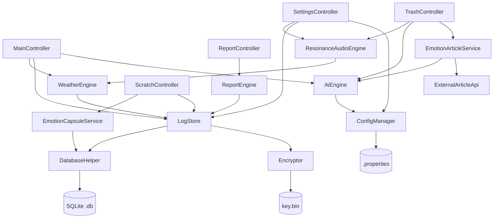
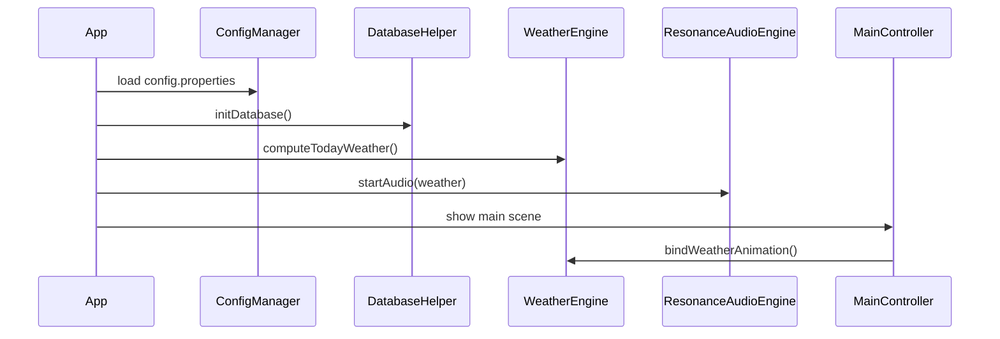

# MindEcho「智愈心海」技术设计文档

## Overview

MindEcho 是一款面向 Windows 平台的轻量化桌面情绪解压工具，以「倾诉即销毁，回望皆释然」为核心理念。用户通过情绪粉碎机自由倾诉，系统返回 AI 情绪回应，倾诉原文经 AES-256-GCM 加密后落盘，所有数据仅存本机。

**技术栈汇总**

| 层次 | 选型 |
|------|------|
| 桌面 UI 框架 | JavaFX 21 + FXML |
| 构建 | Maven |
| AI 调用 | OkHttp 4.x + Gson 2.x → OpenAI Chat Completions API |
| 加密 | javax.crypto AES-256-GCM |
| 持久化 | SQLite（sqlite-jdbc 驱动） |
| 音频播放 | JavaFX MediaPlayer |
| 配置 | .properties 本地文件 |
| 打包 | jpackage（独立 .exe 捆绑 JRE） |
| 平台 | Windows 10+ (x64) |

**设计目标**

- 零网络依赖可用：API 不可达时本地备用话术无缝兜底
- 隐私优先：原文明文不接触磁盘，密钥本地保管
- 模块解耦：Controller 层只依赖 Service 接口，方便单元测试与日后扩展
- 双击即用：jpackage 打包，无需用户安装 JRE

---

## Architecture

### 整体分层架构

```
┌─────────────────────────────────────────────────────────────┐
│                        表现层（UI Layer）                    │
│  JavaFX FXML + Controller                                   │
│  MainController │ ScratchController │ ReportController      │
│  TrashController │ SettingsController                       │
└──────────────┬──────────────────────────────────────────────┘
               │ 调用 Service 接口
┌──────────────▼──────────────────────────────────────────────┐
│                        服务层（Service Layer）                │
│  AiEngine │ Encryptor │ WeatherEngine                        │
│  ResonanceAudioEngine │ ReportEngine │ ScratchQuotaService   │
│  EmotionArticleService │ EmotionCapsuleService               │
└──────────────┬──────────────────────────────────────────────┘
               │ 调用数据访问接口
┌──────────────▼──────────────────────────────────────────────┐
│                  数据访问层（Data Access Layer）              │
│  LogStoreService (接口)                                      │
│  └─ SqliteLogStore (实现)                                    │
│  ScratchQuotaService (接口)                                  │
│  └─ SqliteScratchQuotaStore (实现)                           │
│  EmotionCapsuleService (接口)                                │
│  └─ SqliteCapsuleStore (实现)                                │
└──────────────┬──────────────────────────────────────────────┘
               │ 使用 DatabaseHelper
┌──────────────▼──────────────────────────────────────────────┐
│                  数据持久层（Data Persistence Layer）        │
│  DatabaseHelper (连接管理 + DDL)                            │
└──────────────┬──────────────────────────────────────────────┘
               │ 读写 SQLite 数据库
┌──────────────▼──────────────────────────────────────────────┐
│                    数据库层（Database Layer）                │
│  SQLite Database (mindecho.db)                              │
│  ├─ destruction_log 表                                       │
│  ├─ scratch_quota 表                                         │
│  ├─ emotion_capsule 表                                       │
│  └─ app_metadata 表                                          │
└─────────────────────────────────────────────────────────────┘
               │
┌──────────────┴──────────────────────────────────────────────┐
│                   模型层（Model） + 工具层（Util）           │
│  ┌─────────────────────┐  ┌───────────────────────────┐     │
│  │ DestructionLog      │  │ Encryptor                 │     │
│  │ EmotionLabel        │  │ ConfigManager             │     │
│  │ AiStyle             │  │ FallbackPhraseStore       │     │
│  │ EmotionWeather      │  │ EmotionClassifier         │     │
│  │ AiResponse          │  │ EmotionEventBus           │     │
│  │ EmotionArticle      │  │ ExternalArticleApi        │     │
│  │ EmotionCapsule      │  └───────────────────────────┘     │
│  │ MonthlyReport       │                                    │
│  └─────────────────────┘                                    │
└─────────────────────────────────────────────────────────────┘
```

### 项目目录结构

```
mindecho-1/
├── pom.xml                                  # Maven 构建配置，依赖版本锁定
├── docs/
│   ├── 设计文档.md                          # 技术设计文档
│   └── 需求文档.md                          # 产品需求文档
├── src/
│   ├── main/
│   │   ├── java/
│   │   │   └── com/mindecho/
│   │   │       ├── App.java                 # JavaFX Application 入口，启动流程编排
│   │   │       ├── ServiceLocator.java      # 单例注册表，管理所有 Service 实例
│   │   │       │
│   │   │       ├── controller/              # 表现层：JavaFX Controller
│   │   │       │   ├── MainController.java      # 情绪粉碎机主页
│   │   │       │   ├── ScratchController.java   # AI 情绪胶囊页面
│   │   │       │   ├── ReportController.java    # 月度报告页面
│   │   │       │   ├── TrashController.java     # 情绪文章推荐页面
│   │   │       │   └── SettingsController.java  # 设置页面
│   │   │       │
│   │   │       ├── service/                 # 服务层接口与实现
│   │   │       │   ├── AiEngineService.java         # AI 引擎接口
│   │   │       │   ├── LogStoreService.java         # 日志存储接口
│   │   │       │   ├── ScratchQuotaService.java     # 胶囊配额服务接口
│   │   │       │   ├── WeatherEngine.java           # 情绪天气引擎
│   │   │       │   ├── ResonanceAudioEngine.java    # 情绪共振音引擎
│   │   │       │   ├── ReportEngine.java            # 月度报告引擎
│   │   │       │   ├── EmotionArticleService.java   # 文章推荐服务接口
│   │   │       │   ├── EmotionCapsuleService.java   # 情绪胶囊服务接口
│   │   │       │   └── impl/                        # 服务实现类
│   │   │       │       ├── OpenAiEngine.java        # OpenAI API 实现 + fallback
│   │   │       │       ├── SqliteLogStore.java      # SQLite 日志存储实现
│   │   │       │       ├── SqliteScratchQuotaStore.java  # SQLite 胶囊配额实现
│   │   │       │       ├── SqliteCapsuleStore.java  # SQLite 胶囊存储实现
│   │   │       │       ├── DefaultArticleService.java    # 文章推荐服务实现
│   │   │       │       └── ExternalArticleApi.java       # 第三方文章 API 服务
│   │   │       │
│   │   │       ├── model/                   # 数据模型与枚举
│   │   │       │   ├── DestructionLog.java      # 销毁日志实体
│   │   │       │   ├── AiResponse.java          # AI 回应值对象（record）
│   │   │       │   ├── MonthlyReport.java       # 月度报告 DTO（record）
│   │   │       │   ├── EmotionLabel.java        # 枚举：ANGER / ANXIETY / SADNESS / CALM
│   │   │       │   ├── AiStyle.java             # 枚举：GENTLE / SHARP
│   │   │       │   ├── EmotionWeather.java      # 枚举：THUNDERSTORM / CLOUDY / RAINY / SUNNY
│   │   │       │   ├── EmotionArticle.java      # 情绪文章实体
│   │   │       │   └── EmotionCapsule.java      # 情绪胶囊实体
│   │   │       │
│   │   │       ├── util/                    # 工具层
│   │   │       │   ├── DatabaseHelper.java      # SQLite 连接管理，DDL 初始化
│   │   │       │   ├── ConfigManager.java       # config.properties 读写
│   │   │       │   ├── Encryptor.java           # AES-256-GCM 加解密
│   │   │       │   ├── FallbackPhraseStore.java # 备用话术库懒加载
│   │   │       │   ├── EmotionClassifier.java   # 关键词规则情绪分类
│   │   │       │   └── EmotionEventBus.java     # JavaFX ObjectProperty 事件总线
│   │   │       │
│   │   │       └── ui/                      # 自定义 UI 组件
│   │   │           ├── ScratchCardCanvas.java      # 胶囊翻转动画组件
│   │   │           └── ShredParticleAnimator.java  # 粉碎粒子动画组件
│   │   │
│   │   └── resources/
│   │       ├── com/mindecho/
│   │       │   ├── fxml/
│   │       │   │   ├── main.fxml            # 情绪粉碎机主页布局
│   │       │   │   ├── scratch.fxml         # AI 情绪胶囊页面布局
│   │       │   │   ├── report.fxml          # 月度报告页面布局
│   │       │   │   ├── trash.fxml           # 情绪文章推荐页面布局
│   │       │   │   └── settings.fxml        # 设置页面布局
│   │       │   └── css/
│   │       │       ├── light.css            # 浅色主题「晨雾」样式表
│   │       │       └── dark.css             # 深色主题「夜海」样式表
│   │       ├── audio/
│   │       │   ├── anger.mp3                # 愤怒情绪音场（低沉鼓点+压迫性风声）
│   │       │   ├── anxiety.mp3              # 焦虑情绪音场（低频心跳+风声）
│   │       │   ├── sadness.mp3              # 悲伤情绪音场（雨声+空间混响）
│   │       │   └── calm.mp3                 # 平稳情绪音场（自然白噪音+轻风）
│   │       └── fallback_phrases.json        # 本地备用话术库（GENTLE / SHARP 两组）
│   │
│   └── test/
│       └── java/
│           └── com/mindecho/
│               ├── util/
│               │   ├── EncryptorPropertyTest.java       # P15~P18：加解密属性测试
│               │   ├── DatabaseHelperTest.java          # P14：初始化幂等性
│               │   └── ConfigManagerPropertyTest.java   # P13：配置读写往返
│               ├── service/
│               │   ├── LogStorePropertyTest.java        # P4、P5、P7：日志存储属性测试
│               │   ├── WeatherEnginePropertyTest.java   # P3：天气计算规则
│               │   ├── AiEnginePropertyTest.java        # P1、P2：AI 风格分布 + fallback
│               │   ├── AiEngineIntegrationTest.java     # 集成测试：Mock HTTP 四种场景
│               │   ├── ReportEnginePropertyTest.java    # P9~P11：月度报告属性测试
│               │   ├── ScratchPropertyTest.java         # P6、P8：配额不变量 + 不暴露原文
│               │   └── ResonanceAudioEngineTest.java    # 单元测试：Mock MediaPlayer
│               └── controller/
│                   ├── TrashControllerPropertyTest.java # P12：垃圾桶无副作用
│                   ├── MainControllerTest.java          # TestFX：粉碎机 UI 流程
│                   └── ScratchControllerTest.java       # TestFX：情绪胶囊 UI 状态
```

> **包命名约定**：根包 `com.mindecho`，子包按层次划分（`controller` / `service` / `service.impl` / `model` / `util` / `ui`）。资源文件路径与包结构对齐，FXML 通过 `getClass().getResource()` 加载。

### 关键设计决策

1. **单例 Service**：所有 Service 组件以单例形式通过 `ServiceLocator`（简单工厂）管理，避免 Controller 持有多个 Service 实例导致状态不一致。
2. **异步 AI 调用**：AiEngine 的 OpenAI 调用在 JavaFX `Task<AiResponse>` 中执行，结果通过 `Platform.runLater()` 回调至 UI 线程，保证界面不卡顿。
3. **观察者联动**：LogStore 写入成功后通过 `EmotionEventBus`（基于 JavaFX `ObjectProperty`）广播情绪变化事件，WeatherEngine 与 ResonanceAudioEngine 订阅该事件实现自动联动，无需 Controller 手动协调。
4. **备用话术库懒加载**：`fallback_phrases.json` 在 AiEngine 首次 fallback 时一次性解析缓存至内存，后续直接从内存随机取。

### 模块依赖图（Mermaid）



### 启动流程



---

## 表现层（UI Layer）设计

### MainController - 情绪粉碎机

**职责**：
- 提供无字数限制的文本输入框
- 调用 AI 引擎获取回应并展示
- 保存销毁日志

**需求**：
- 用户可以在无限制的输入框中自由倾诉
- 点击粉碎按钮后直接调用 AI
- 清空输入框并重置焦点
- 展示 AI 回应（15~40 字中文，GENTLE/SHARP 两种风格）

### ScratchController - AI 情绪胶囊

**职责**：
- 展示胶囊墙，显示所有胶囊状态
- 封存新胶囊，设置解锁时间
- 解锁已到期的胶囊，查看内容和成长回顾
- 管理每日封存配额

**需求**：
- 每日最多封存 3 个胶囊，按自然日重置
- 剩余次数为 0 时禁用封存按钮
- 胶囊未到解锁时间时显示倒计时
- 胶囊内容加密存储，解锁时解密显示
- AI 生成成长回顾寄语
- 支持按状态筛选（全部/未解锁/已解锁）

### ReportController - 月度报告

**职责**：
- 展示月度情绪统计数据
- 展示情绪排名
- 提供个性化建议

**需求**：
- 聚合当月销毁日志数据
- 展示情绪标签排名（按频次降序）
- 展示每周倾诉频次
- 展示 GENTLE/SHARP 风格分布
- 根据高频情绪提供个性化建议
- 当月无数据时展示提示信息

### TrashController - 情绪文章推荐

**职责**：
- 提供情绪文章分类浏览
- AI 心情识别与个性化推荐
- 心情识别与音效联动
- AI 生成定制文章
- 第三方网络文章导入

**需求**：
- AI 心情识别：用户输入心情描述，AI 自动分析情绪类型和压力等级，自动切换到对应主题标签和环境音效
- 文章分类浏览：支持按主题标签筛选（情绪管理、压力管理、悲伤疗愈、焦虑管理等）
- AI 生成文章：选择情绪主题生成定制文章，支持 7 种预设情绪
- 网络文章导入：一键从第三方 API（ZenQuotes、Hitokoto、ApiZero）导入精选文章
- 文章详情弹窗：展示完整内容，支持滚动阅读，带有缩放淡入动画

**心情识别与音效联动流程**：
1. 用户输入心情描述 → 点击「分析心情」
2. AI 分析情绪类型（英文标签：ANGER/ANXIETY/SADNESS/HAPPY）和压力等级（1-5）
3. 情绪标签映射到文章主题：ANGER→情绪管理，ANXIETY→焦虑管理，SADNESS→悲伤疗愈，HAPPY→放松技巧
4. 情绪标签映射到天气音效：ANGER→THUNDERSTORM，ANXIETY（高压力）→THUNDERSTORM，ANXIETY（低压力）→CLOUDY，SADNESS→RAINY，HAPPY→SUNNY
5. 调用 ResonanceAudioEngine.switchTo() 切换环境音效（2秒淡入淡出）
6. 自动高亮对应主题标签，筛选显示对应主题文章

### SettingsController - 设置

**职责**：
- 管理应用配置
- 提供一键销毁功能

**需求**：
- 配置 OpenAI API Key
- 切换浅色/深色主题
- 开关音效
- 一键销毁所有数据（二次确认）

---

## 服务层（Service Layer）设计

### AiEngineService

**职责**：调用 OpenAI Chat Completions API 或本地备用话术库，返回带情绪标签与风格的 AI 回应。

```java
public interface AiEngineService {
    /**
     * 异步生成 AI 回应。
     * @param text    用户倾诉原文（明文，仅在内存中使用，不落盘）
     * @param callback 结果回调，在 JavaFX Application Thread 执行
     */
    void generateResponseAsync(String text, Consumer<AiResponse> callback);
}

/** AI 回应值对象 */
public record AiResponse(
    String responseText,   // 15~40 字中文回应
    AiStyle style,         // GENTLE | SHARP
    EmotionLabel emotion   // ANGER | ANXIETY | SADNESS | CALM
) {}
```

**实现策略**：
- 随机选取 `AiStyle`（Math.random() < 0.5 → GENTLE，否则 SHARP）
- 构造 System Prompt 指定风格与字数约束，User Prompt 为倾诉原文
- OkHttp 发起 POST 请求，设置 `connectTimeout(10, SECONDS)` + `readTimeout(10, SECONDS)`
- 解析 Gson `JsonObject` 取 `choices[0].message.content`
- 情绪标签从 API 响应的额外字段或通过关键词规则解析（见 EmotionClassifier）
- 任何异常走 `FallbackPhraseStore.getRandom(style)`

**EmotionClassifier 关键词规则**（当 API 未返回情绪字段时使用）：

| 关键词集合 | → EmotionLabel |
|---------|-------------|
| 愤怒、气死、烦透、滚、去死 | ANGER |
| 焦虑、担心、睡不着、不安、压力 | ANXIETY |
| 难过、委屈、哭、伤心、失落 | SADNESS |
| 其他 / 无命中 | CALM |

### Encryptor

**职责**：AES-256-GCM 加解密，密钥管理。

```java
public class Encryptor {
    /** 加密，每次生成随机 12 字节 IV，返回 IV + 密文 + GCM Tag 拼接 */
    public byte[] encrypt(String plaintext) throws EncryptionException;

    /** 解密，从字节数组中提取 IV，返回原文字符串 */
    public String decrypt(byte[] cipherData) throws DecryptionException;

    /** 懒加载密钥：从 %APPDATA%/MindEcho/key.bin 读取；不存在则生成 32 字节随机密钥并持久化 */
    private SecretKey loadOrGenerateKey();
}
```

**加密数据格式**（字节布局）：
```
[0..11]  IV (12 bytes, GCM nonce)
[12..N]  AES-GCM ciphertext + 16-byte auth tag
```

### LogStoreService

**职责**：SQLite 日志 CRUD，包装加密/解密调用。

```java
public interface LogStoreService {
    /** 写入一条销毁日志（原文加密后存储） */
    void save(DestructionLog log) throws StorageException;

    /** 查询某自然日的全部日志（不含原文） */
    List<DestructionLog> findByDate(LocalDate date);

    /** 查询某自然月的全部日志 */
    List<DestructionLog> findByMonth(YearMonth month);

    /** 随机抽取一条历史日志 */
    Optional<DestructionLog> findRandom();

    /** 清空全部日志 */
    void deleteAll() throws StorageException;

    /** 查询全部日志总数 */
    int countAll();
}
```

### WeatherEngine

**职责**：根据当日情绪标签分布计算 `EmotionWeather`。

```java
public class WeatherEngine {
    /**
     * 输入当日情绪标签列表，输出天气类型。
     * 规则（优先级从高到低）：
     *   1. ANGER 占比 > 40% → THUNDERSTORM
     *   2. ANXIETY 为最高频标签（且不满足规则1）→ CLOUDY
     *   3. SADNESS 存在（且不满足规则1、2）→ RAINY
     *   4. 其余 → SUNNY
     * 若列表为空 → SUNNY
     */
    public EmotionWeather compute(List<EmotionLabel> todayLabels);
}
```

### ResonanceAudioEngine

**职责**：基于 JavaFX MediaPlayer 管理情绪音场的淡入淡出切换。

```java
public class ResonanceAudioEngine {
    /** 根据天气类型切换音场（淡出当前 → 淡入新音场） */
    public void switchTo(EmotionWeather weather);

    /** 停止播放 */
    public void stop();

    /** 恢复播放当前天气对应音场 */
    public void resume(EmotionWeather currentWeather);

    /** 音场-文件映射（内部） */
    // THUNDERSTORM/ANGER → anger.mp3
    // CLOUDY/ANXIETY     → anxiety.mp3
    // RAINY/SADNESS      → sadness.mp3
    // SUNNY/CALM         → calm.mp3
}
```

**淡入淡出实现**：使用 JavaFX `Timeline` + `KeyFrame` 在 1~3 秒内线性调整 `MediaPlayer.setVolume()`，淡出至 0 后调用 `stop()`，再启动新 MediaPlayer 执行淡入。

### ReportEngine

**职责**：聚合月度数据，生成统计报告 DTO。

```java
public class ReportEngine {
    /** 生成当月报告 DTO */
    public MonthlyReport generate(YearMonth month);
}

public record MonthlyReport(
    YearMonth month,
    List<Map.Entry<EmotionLabel, Integer>> emotionRanking,  // 按频次降序
    List<Integer> weeklyFrequency,                          // 索引0=第1周...索引N=第N周
    int gentleCount,
    int sharpCount,
    List<String> suggestions                                // 个性化建议文本列表
) {}
```

### ScratchQuotaService

**职责**：管理情绪胶囊每日配额。

```java
public interface ScratchQuotaService {
    /** 查询当日剩余次数 */
    int getRemainingToday();

    /** 扣减当日配额（原子操作） */
    void consumeOne();

    /** 检查配额是否已用完 */
    boolean isExhausted();
}
```

### EmotionArticleService

**职责**：文章推荐服务，管理预置文章、AI 生成文章和第三方网络文章。

```java
public interface EmotionArticleService {
    /** 获取所有文章 */
    List<EmotionArticle> getAllArticles();

    /** 按分类筛选文章 */
    List<EmotionArticle> getArticlesByCategory(String category);

    /** 添加新文章 */
    void addArticle(EmotionArticle article);

    /** AI 生成情绪文章 */
    void generateEmotionArticleAsync(String emotion, Consumer<String> callback);

    /** 从第三方 API 获取随机文章 */
    void fetchExternalArticles(int count, Consumer<List<EmotionArticle>> callback);

    /** 从第三方 API 获取指定分类文章 */
    void fetchExternalArticleByCategory(String category, Consumer<EmotionArticle> callback);
}

/** 情绪文章实体 */
public class EmotionArticle {
    private String id;
    private String title;
    private String content;
    private String category;
    private String emotionIcon;
    private String author;
    private String source;
}
```

**实现策略**：
- `DefaultArticleService`：管理内存中的预置文章列表
- 预置文章在服务初始化时加载（10篇）
- AI 生成文章调用 `AiEngineService.generateEmotionArticleAsync()`
- 第三方文章调用 `ExternalArticleApi.fetchRandomArticlesAsync()` 和 `fetchArticleByCategoryAsync()`
- 外部文章自动转换为 `EmotionArticle` 格式并添加到文章列表顶部

### ExternalArticleApi

**职责**：第三方文章 API 服务，集成多个开放 API 源。

```java
public class ExternalArticleApi {
    /** 异步获取随机文章 */
    void fetchRandomArticlesAsync(int count, Consumer<List<ExternalArticleResult>> callback);

    /** 异步获取指定分类文章 */
    void fetchArticleByCategoryAsync(String category, Consumer<ExternalArticleResult> callback);

    /** API 结果记录 */
    record ExternalArticleResult(String quote, String author, String category) {}
}
```

**集成的 API 源**：
- **ZenQuotes**：`https://zenquotes.io/api/random`，英文箴言，无需密钥
- **Hitokoto 一言**：`https://v1.hitokoto.cn/`，中文多分类句子
- **ApiZero 语录**：`https://apizero.cn/marketplace/hitokoto`，中文经典语录

**失败处理**：任一 API 失败时自动尝试下一个 API，全部失败时使用本地备用内容。

### EmotionCapsuleService

**职责**：情绪胶囊服务，管理胶囊的封存、查询和解锁。

```java
public interface EmotionCapsuleService {
    /** 保存胶囊 */
    void saveCapsule(EmotionCapsule capsule);

    /** 获取所有胶囊 */
    List<EmotionCapsule> getAllCapsules();

    /** 获取未解锁胶囊 */
    List<EmotionCapsule> getLockedCapsules();

    /** 获取已解锁胶囊 */
    List<EmotionCapsule> getUnlockedCapsules();

    /** 根据 ID 获取胶囊 */
    EmotionCapsule getCapsuleById(String id);

    /** 更新胶囊（解锁、更新成长回顾） */
    void updateCapsule(EmotionCapsule capsule);

    /** 删除胶囊 */
    void deleteCapsule(String id);

    /** 获取今日已封存数量 */
    int getTodayCount();
}

/** 情绪胶囊实体 */
public class EmotionCapsule {
    private String id;
    private String content;
    private String emotion;
    private int stressLevel;
    private LocalDateTime createdAt;
    private LocalDateTime unlockAt;
    private boolean opened;
    private String growthReview;

    /** 判断胶囊是否已到解锁时间 */
    public boolean isUnlocked() {
        return opened || LocalDateTime.now().isAfter(unlockAt);
    }
}
```

**实现策略**：
- `SqliteCapsuleStore`：使用 SQLite 存储胶囊数据
- 胶囊内容加密存储（AES-256-GCM）
- 支持按状态筛选（全部/未解锁/已解锁）
- 每日最多封存 3 个胶囊

---

## 数据访问层（Data Access Layer）设计

### LogStoreService SQLite 实现

**职责**：
- 通过 DatabaseHelper 操作 destruction_log 表
- 自动处理加密/解密
- 提供 CRUD 操作

**关键操作**：
- save(): 加密原文后 INSERT
- findByDate/findByMonth(): 按日期范围 SELECT，不包含原文
- findRandom(): ORDER BY RANDOM() LIMIT 1
- deleteAll(): TRUNCATE 或 DELETE FROM
- countAll(): SELECT COUNT(*)

### ScratchQuotaService SQLite 实现

**职责**：
- 操作 scratch_quota 表
- 管理每日 3 次配额

**关键操作**：
- getRemainingToday(): SELECT COALESCE(remaining, 3)
- consumeOne(): INSERT OR REPLACE
- isExhausted(): 检查剩余 ≤ 0

---

## 数据持久层（Data Persistence Layer）设计

### DatabaseHelper

```java
public class DatabaseHelper {
    private static final String DB_PATH =
        System.getenv("APPDATA") + "/MindEcho/mindecho.db";

    /** 获取单例 Connection（使用连接池或单连接 + synchronized） */
    public static Connection getConnection();

    /** 应用启动时执行 DDL，幂等 */
    public static void initDatabase();
}
```

### ConfigManager

```java
public class ConfigManager {
    public String get(String key);
    public void set(String key, String value);
    public void save();                        // 持久化至 config.properties
    public boolean isApiKeyConfigured();
}
```

### EmotionEventBus

```java
/**
 * 单例事件总线，基于 JavaFX ObjectProperty<EmotionLabel>。
 * LogStore 写入成功后 publish，WeatherEngine 与 ResonanceAudioEngine 订阅。
 */
public class EmotionEventBus {
    private static final EmotionEventBus INSTANCE = new EmotionEventBus();
    private final ObjectProperty<EmotionLabel> latestEmotion = new SimpleObjectProperty<>();

    public void publish(EmotionLabel label);
    public void subscribe(ChangeListener<EmotionLabel> listener);
}
```

---

## 数据库层（Database Layer）设计

### SQLite 数据库 Schema

```sql
-- ============================================================
-- 数据库文件路径：项目 data 目录下 mindecho.db
-- 字符集：UTF-8（SQLite 默认）
-- 所有 DDL 使用 CREATE TABLE IF NOT EXISTS 保证幂等性
-- ============================================================

-- 销毁日志表
-- 存储每次倾诉行为的加密记录，原文以 AES-256-GCM 密文形式存储
CREATE TABLE IF NOT EXISTS destruction_log (
    id             INTEGER PRIMARY KEY AUTOINCREMENT,
    encrypted_text BLOB    NOT NULL,         -- IV(12B) + ciphertext + GCM Tag(16B)
    ai_response    TEXT    NOT NULL,         -- AI 回应明文，15~40 字
    emotion_label  TEXT    NOT NULL          -- 枚举：ANGER / ANXIETY / SADNESS / CALM
                   CHECK (emotion_label IN ('ANGER','ANXIETY','SADNESS','CALM')),
    ai_style       TEXT    NOT NULL          -- 枚举：GENTLE / SHARP
                   CHECK (ai_style IN ('GENTLE','SHARP')),
    created_at     TEXT    NOT NULL          -- ISO-8601，如 "2025-01-15T14:30:00"
);

-- 索引：按日期查询（findByDate / findByMonth 的高频路径）
CREATE INDEX IF NOT EXISTS idx_destruction_log_created_at
    ON destruction_log (created_at);

-- 索引：按情绪标签查询（情绪天气、月度报告的高频路径）
CREATE INDEX IF NOT EXISTS idx_destruction_log_emotion_label
    ON destruction_log (emotion_label);

-- 索引：按 AI 风格查询（月度报告的高频路径）
CREATE INDEX IF NOT EXISTS idx_destruction_log_ai_style
    ON destruction_log (ai_style);

-- 情绪胶囊表
-- 存储用户封存的情绪胶囊，支持时间解锁和成长回顾
CREATE TABLE IF NOT EXISTS emotion_capsule (
    id             TEXT    PRIMARY KEY,      -- 胶囊唯一标识（UUID）
    encrypted_content BLOB NOT NULL,         -- 封存内容（AES-256-GCM 加密）
    emotion        TEXT    NOT NULL,         -- 情绪标签
    stress_level   INTEGER NOT NULL,         -- 压力等级 1-5
    created_at     TEXT    NOT NULL,         -- 封存时间
    unlock_at      TEXT    NOT NULL,         -- 解锁时间
    opened         INTEGER NOT NULL DEFAULT 0, -- 是否已解锁（0/1）
    growth_review  TEXT                      -- AI 成长回顾
);

-- 索引：按创建时间查询
CREATE INDEX IF NOT EXISTS idx_emotion_capsule_created_at
    ON emotion_capsule (created_at);

-- 索引：按解锁时间查询
CREATE INDEX IF NOT EXISTS idx_emotion_capsule_unlock_at
    ON emotion_capsule (unlock_at);

-- 胶囊每日配额表
-- 按自然日（quota_date）键控，跨日自动重置为 3
CREATE TABLE IF NOT EXISTS scratch_quota (
    quota_date     TEXT    PRIMARY KEY,      -- "2025-01-15"（LocalDate.toString()）
    remaining      INTEGER NOT NULL DEFAULT 3
                   CHECK (remaining >= 0 AND remaining <= 3)
);

-- 应用元数据表
-- 存储应用版本、数据库版本、最后使用时间等元信息
CREATE TABLE IF NOT EXISTS app_metadata (
    key            TEXT    PRIMARY KEY,      -- 元数据键名
    value          TEXT    NOT NULL          -- 元数据值
);
```

**表关系说明**

```
destruction_log                emotion_capsule              scratch_quota                app_metadata
───────────────                ───────────────              ─────────────                ────────────
id (PK)                        id (PK)                      quota_date (PK)              key (PK)
encrypted_text                 encrypted_content            remaining                    value
ai_response                    emotion
emotion_label                  stress_level
ai_style                       created_at
created_at                     unlock_at
                               opened
                               growth_review
```

四张表相互独立，无外键约束。`scratch_quota` 仅用于限速。`emotion_capsule` 存储用户封存的情绪胶囊数据。`app_metadata` 用于存储应用配置和版本信息。

### 数据库运用场景详解

#### 情绪数据持久化与隐私保护

**运用方式**：
- 每次用户倾诉后，原文使用 AES-256-GCM 加密后存储在 `encrypted_text` 字段
- AI 回应、情绪标签、AI 风格等元数据以明文形式存储
- 密钥单独存储在 `%APPDATA%/MindEcho/key.bin`，不与数据库文件同目录
- 数据库文件本身不加密，但敏感内容（用户倾诉原文）已加密

**优势**：
- 即使数据库文件泄露，没有密钥也无法解密原文
- 加密粒度为单条记录，支持灵活的解密场景
- 元数据明文存储便于快速查询和统计

#### 情绪天气实时计算

**运用方式**：
- 通过 `idx_destruction_log_created_at` 索引快速查询当日所有记录
- 提取 `emotion_label` 字段进行统计分析
- 根据情绪标签分布计算当日天气类型

**查询示例**：
```sql
-- 查询当日所有情绪标签
SELECT emotion_label
FROM destruction_log
WHERE created_at >= '2025-06-24T00:00:00'
  AND created_at <= '2025-06-24T23:59:59';

-- 统计当日各情绪标签数量
SELECT emotion_label, COUNT(*) as count
FROM destruction_log
WHERE created_at >= '2025-06-24T00:00:00'
  AND created_at <= '2025-06-24T23:59:59'
GROUP BY emotion_label
ORDER BY count DESC;
```

#### 月度情绪报告生成

**运用方式**：
- 使用 `idx_destruction_log_created_at` 索引按月份范围查询
- 结合 `emotion_label` 和 `ai_style` 索引进行多维度统计
- 计算每周频次、情绪排名、AI 风格分布等数据

**查询示例**：
```sql
-- 按月查询所有记录
SELECT * FROM destruction_log
WHERE created_at >= '2025-06-01T00:00:00'
  AND created_at <= '2025-06-30T23:59:59';

-- 按周统计倾诉频次
SELECT
    STRFTIME('%W', created_at) as week,
    COUNT(*) as count
FROM destruction_log
WHERE created_at >= '2025-06-01T00:00:00'
  AND created_at <= '2025-06-30T23:59:59'
GROUP BY week
ORDER BY week;

-- 情绪标签排名
SELECT emotion_label, COUNT(*) as count
FROM destruction_log
WHERE created_at >= '2025-06-01T00:00:00'
  AND created_at <= '2025-06-30T23:59:59'
GROUP BY emotion_label
ORDER BY count DESC;

-- AI 风格分布
SELECT ai_style, COUNT(*) as count
FROM destruction_log
WHERE created_at >= '2025-06-01T00:00:00'
  AND created_at <= '2025-06-30T23:59:59'
GROUP BY ai_style;
```

#### 胶囊配额管理

**运用方式**：
- `scratch_quota` 表使用自然日期作为主键，天然支持按日重置
- 查询时直接通过主键查找，性能最优
- 使用 `CHECK` 约束在数据库层面保证剩余次数在 0-3 范围内

**操作示例**：
```sql
-- 查询当日剩余次数（不存在则返回默认值 3）
SELECT COALESCE(remaining, 3) as remaining
FROM scratch_quota
WHERE quota_date = '2025-06-24';

-- 扣减当日配额（原子操作）
INSERT OR REPLACE INTO scratch_quota (quota_date, remaining)
VALUES ('2025-06-24',
    COALESCE((SELECT remaining FROM scratch_quota WHERE quota_date = '2025-06-24'), 3) - 1
);

-- 重置配额（一键销毁时使用）
DELETE FROM scratch_quota;
```

#### 随机抽取历史记录

**运用方式**：
- 利用 SQLite 内置的 `RANDOM()` 函数实现随机排序
- 使用 `LIMIT 1` 只返回一条记录
- 通过索引优化确保查询性能

**查询示例**：
```sql
-- 随机抽取一条历史记录
SELECT * FROM destruction_log
ORDER BY RANDOM()
LIMIT 1;
```

#### 应用元数据管理

**运用方式**：
- 存储数据库版本号，支持未来数据库升级
- 记录应用最后使用时间，用于统计分析
- 保存用户偏好设置（可选）

**操作示例**：
```sql
-- 插入或更新元数据
INSERT OR REPLACE INTO app_metadata (key, value)
VALUES ('db_version', '1.0');

INSERT OR REPLACE INTO app_metadata (key, value)
VALUES ('last_used', '2025-06-24T14:30:00');

-- 查询元数据
SELECT value FROM app_metadata WHERE key = 'db_version';
```

### 数据库访问最佳实践

#### 连接管理
- 使用单例连接模式，避免频繁创建/关闭连接
- 通过 `DatabaseHelper.getConnection()` 获取全局统一连接
- 应用关闭时才关闭数据库连接

#### 事务管理
- 对于写入操作（INSERT/UPDATE/DELETE），使用事务保证数据一致性
- 批量操作时使用事务提升性能

**示例**：
```java
try (Connection conn = DatabaseHelper.getConnection()) {
    conn.setAutoCommit(false);
    try {
        // 执行多个写入操作
        saveLog(conn, log1);
        saveLog(conn, log2);
        conn.commit();
    } catch (SQLException e) {
        conn.rollback();
        throw e;
    }
}
```

#### 参数化查询
- 始终使用 `PreparedStatement` 进行参数化查询
- 避免 SQL 注入风险（虽然本项目是本地应用，仍应保持良好习惯）

**示例**：
```java
String sql = "SELECT * FROM destruction_log WHERE created_at >= ? AND created_at <= ?";
try (PreparedStatement stmt = conn.prepareStatement(sql)) {
    stmt.setString(1, startDate);
    stmt.setString(2, endDate);
    try (ResultSet rs = stmt.executeQuery()) {
        // 处理结果
    }
}
```

#### 性能优化
- 为高频查询字段创建索引（已在 Schema 中定义）
- 查询时只选择需要的字段，避免 `SELECT *`
- 对于统计查询，使用 SQL 聚合函数而非在应用层计算

#### 错误处理
- 捕获 `SQLException` 并记录详细错误日志
- 对于非致命错误（如写入失败），提供友好的用户提示
- 确保资源（Connection/Statement/ResultSet）正确关闭（使用 try-with-resources）

### 数据库备份与恢复（可选扩展）

虽然当前版本未实现备份功能，但数据库设计支持以下扩展：

**备份方案**：
- 直接复制 `mindecho.db` 文件到备份目录
- 使用 SQLite 的 `VACUUM INTO` 命令创建备份副本

**恢复方案**：
- 将备份文件复制回原位置
- 应用启动时自动检测并使用备份文件

**SQL 备份示例**：
```sql
-- 创建数据库备份
VACUUM INTO 'mindecho_backup_20250624.db';
```

### 数据库架构设计与扩展性

#### 扩展性设计

**数据库版本管理**：
- 通过 `app_metadata` 表存储数据库版本号
- 支持未来数据库结构升级
- 可以实现迁移脚本执行

**潜在扩展功能**：
1. **情绪趋势分析**：基于历史数据进行长期趋势统计
2. **情绪提醒**：根据情绪模式提供个性化建议
3. **数据导出**：支持导出统计数据为 CSV/JSON 格式
4. **多用户支持**：扩展表结构支持多用户隔离
5. **云端同步**：可选的加密数据云端同步功能

---

## 模型层（Model）设计

### DestructionLog - 销毁日志实体

```java
public class DestructionLog {
    private Long id;                     // 主键，自增
    private byte[] encryptedText;        // AES-256-GCM 密文（IV + ciphertext + tag）
    private String aiResponse;           // AI 回应明文（15~40 字）
    private EmotionLabel emotionLabel;   // 情绪标签枚举
    private AiStyle aiStyle;             // AI 风格枚举
    private LocalDateTime createdAt;     // 记录创建时间（本地时区）
}
```

### 枚举定义

```java
public enum EmotionLabel {
    ANGER,      // 愤怒
    ANXIETY,    // 焦虑
    SADNESS,    // 悲伤
    CALM        // 平静
}

public enum AiStyle {
    GENTLE,     // 温柔治愈
    SHARP       // 清醒毒舌
}

public enum EmotionWeather {
    THUNDERSTORM,   // 雷雨
    CLOUDY,         // 阴天
    RAINY,          // 小雨
    SUNNY           // 晴天
}
```

### 值对象

```java
/** AI 回应值对象 */
public record AiResponse(
    String responseText,   // 15~40 字中文回应
    AiStyle style,         // GENTLE | SHARP
    EmotionLabel emotion   // ANGER | ANXIETY | SADNESS | CALM
) {}

/** 月度报告 DTO */
public record MonthlyReport(
    YearMonth month,
    List<Map.Entry<EmotionLabel, Integer>> emotionRanking,  // 按频次降序
    List<Integer> weeklyFrequency,                          // 索引0=第1周...索引N=第N周
    int gentleCount,
    int sharpCount,
    List<String> suggestions                                // 个性化建议文本列表
) {}
```

---

## 工具层（Util）设计

### 配置文件 config.properties 结构

```properties
# OpenAI 配置
openai.api.key=
openai.model=gpt-4o-mini
openai.max_tokens=100
openai.base_url=https://api.openai.com/v1

# 应用配置
app.theme=light          # light | dark
app.audio.enabled=true

# 数据库路径（留空则使用默认 APPDATA 路径）
app.db.path=
```

### fallback_phrases.json 结构

```json
{
  "GENTLE": [
    "你已经很努力了，这种感觉不会一直持续的。",
    "能倾诉出来就已经是在好好爱自己了。"
  ],
  "SHARP": [
    "这点事搞成这样，你也是一绝。",
    "行了行了，发泄完了继续打工吧。"
  ]
}
```

---

## 核心算法说明

### 天气类型计算算法

```
输入：List<EmotionLabel> labels（当日全部情绪标签，可为空）
输出：EmotionWeather

步骤：
1. 若 labels 为空 → 返回 SUNNY
2. 计算 total = labels.size()
3. 计算 angerCount = count(ANGER in labels)
4. 若 angerCount / total > 0.40 → 返回 THUNDERSTORM
5. 找出最高频标签 dominant = argmax(frequency)
6. 若 dominant == ANXIETY → 返回 CLOUDY
7. 若 SADNESS 在 labels 中存在（count > 0）→ 返回 RAINY
8. → 返回 SUNNY
```

### 胶囊翻转动画算法

1. 胶囊卡片使用 CSS 3D 变换实现翻转动画效果
2. 正面显示胶囊状态（情绪图标、封存日期、解锁倒计时）
3. 背面显示胶囊内容（情绪标签、封存内容、成长回顾）
4. 使用 ScaleTransition 和 FadeTransition 组合实现平滑翻转动画（400ms）
5. 点击已解锁胶囊时触发翻转，显示完整内容

### AES-256-GCM 加解密流程

```
加密：
  1. 生成 32 字节 SecretKey（AES）
  2. 生成 12 字节随机 IV（SecureRandom）
  3. Cipher.getInstance("AES/GCM/NoPadding")
  4. cipher.init(ENCRYPT_MODE, key, new GCMParameterSpec(128, iv))
  5. cipherBytes = cipher.doFinal(plaintext.getBytes(UTF-8))
  6. 返回 iv + cipherBytes（cipherBytes 末尾含 16 字节 GCM Tag）

解密：
  1. 从字节数组提取 iv = bytes[0..11]
  2. 提取 cipherBytes = bytes[12..]
  3. cipher.init(DECRYPT_MODE, key, new GCMParameterSpec(128, iv))
  4. plainBytes = cipher.doFinal(cipherBytes)
  5. 返回 new String(plainBytes, UTF-8)
  注：密钥不匹配或密文被篡改时 doFinal 抛出 AEADBadTagException
```

---

## Correctness Properties

*属性（Property）是在系统所有合法执行中均应成立的特征或行为——本质上是关于系统应当做什么的形式化陈述。属性是人类可读规约与机器可验证正确性保证之间的桥梁。*

### Property 1: AI 回应风格随机分布

*对任意* 大量（≥ 1000 次）随机 `AiStyle` 选取操作，`GENTLE` 与 `SHARP` 各自出现的比例应均落在 40%～60% 之间，满足约 50/50 的随机分布。

**Validates: Requirements 2.1**

### Property 2: Fallback 话术非空且风格匹配

*对任意* `AiStyle` 枚举值（`GENTLE` 或 `SHARP`），从 `fallback_phrases.json` 备用话术库中为该风格随机选取的结果应非 null、非空字符串，且来自该风格对应的话术集合。

**Validates: Requirements 2.4**

### Property 3: 天气计算规则正确性

*对任意* `EmotionLabel` 列表（包含空列表），`WeatherEngine.compute()` 的返回值应严格满足四条优先级规则：① `ANGER` 占比 > 40% → `THUNDERSTORM`；② `ANXIETY` 为最高频且不满足① → `CLOUDY`；③ `SADNESS` 存在且不满足①② → `RAINY`；④ 其余（含空列表）→ `SUNNY`。

**Validates: Requirements 5.1, 5.2, 5.4**

### Property 4: 日志存储往返完整性

*对任意* 合法的 `DestructionLog` 对象（含任意 `aiResponse` 文本、任意 `EmotionLabel`、任意 `AiStyle`、任意时间戳），`LogStore.save(log)` 后通过 `findByDate(log.getCreatedAt().toLocalDate())` 应能找到该条记录，且 `aiResponse`、`emotionLabel`、`aiStyle`、`createdAt` 四个字段与原对象完全一致。

**Validates: Requirements 3.3**

### Property 5: 全量删除后记录数归零

*对任意* 预先插入 n 条（n ≥ 0）`DestructionLog` 记录后，调用 `LogStore.deleteAll()` 后 `LogStore.countAll()` 应返回 0。

**Validates: Requirements 4.3**

### Property 6: 胶囊配额不变量

*对任意* 自然日内的胶囊操作序列，当日已成功封存的胶囊数量不得超过 3 次，且每次成功封存后当日剩余次数应恰好减少 1（不允许超减或不减）。

**Validates: Requirements 3.2.4**

### Property 7: 随机抽取结果属于历史集合

*对任意* 非空的历史 `DestructionLog` 集合，`LogStore.findRandom()` 返回的记录应属于该集合（即返回记录的 `id` 存在于历史记录 id 集合中）。

**Validates: Requirements 3.1.4**

### Property 8: 胶囊内容不暴露原文

*对任意* `EmotionCapsule` 记录，构造供胶囊展示的数据时，未解锁的胶囊不应包含 `encryptedContent`（密文字节数组）字段，仅应包含情绪标签、封存日期和解锁倒计时。

**Validates: Requirements 6.4**

### Property 9: 情绪排名按频次降序

*对任意* 月度 `EmotionLabel` 日志列表，`ReportEngine.generate()` 返回的 `emotionRanking` 列表应满足降序不变量：对所有相邻索引 i，`ranking[i].count >= ranking[i+1].count`。

**Validates: Requirements 7.1**

### Property 10: 月度统计数据自洽

*对任意* 月度 `DestructionLog` 列表，以下两条一致性约束应同时成立：
① `weeklyFrequency` 各元素之和等于该月日志总条数；
② `gentleCount + sharpCount` 等于该月日志总条数。

**Validates: Requirements 7.2, 7.3**

### Property 11: 非空月度数据必有调节建议

*对任意* 非空月度 `DestructionLog` 列表，`ReportEngine.generate()` 返回的 `suggestions` 列表 `size() >= 1`（至少包含 1 条个性化建议）。

**Validates: Requirements 7.4**

### Property 12: 垃圾桶提交无任何副作用

*对任意* 文本内容（包括任意长度、任意字符的字符串），垃圾桶页面提交操作前后，`LogStore.countAll()` 的返回值不应发生变化，且 `AiEngine`、`WeatherEngine`、`EmotionEventBus` 均不应收到任何调用。

**Validates: Requirements 8.3, 8.4**

### Property 13: 配置管理器读写往返

*对任意* 合法的配置键值对（键为非空字符串，值为字符串），执行 `ConfigManager.set(key, value)` → `save()` → 重新实例化加载（模拟应用重启读取）→ `get(key)` 后，返回值应与写入值完全相同。

**Validates: Requirements 10.2, 10.5**

### Property 14: 数据库初始化幂等性

*对任意* 调用次数 n（n ≥ 1），连续调用 `DatabaseHelper.initDatabase()` n 次后，数据库中 `destruction_log` 表与 `scratch_quota` 表应恰好各存在一张，且表结构（列名与类型）与 Schema 定义完全一致，不产生重复表或错误。

**Validates: Requirements 10.4**

### Property 15: AES-256-GCM 加解密往返

*对任意* 非空 Java `String`（任意 Unicode 字符、任意长度），`Encryptor.decrypt(Encryptor.encrypt(s))` 应返回与原始字符串完全相同的字符串。

**Validates: Requirements 3.2, 11.1**

### Property 16: 每次加密产生不同密文（IV 随机性）

*对任意* 非空字符串 s，对 s 的两次独立加密调用 `encrypt(s)` 应产生内容不同的字节数组（IV 不重复保证），但两次结果均可被正确解密还原为 s。

**Validates: Requirements 11.2**

### Property 17: 错误密钥解密抛出认证异常

*对任意* 非空字符串 s，使用密钥 K1 加密后，用任意不同于 K1 的密钥 K2 尝试解密，应抛出 `javax.crypto.AEADBadTagException`，不返回任何明文数据。

**Validates: Requirements 11.3**

### Property 18: 篡改密文解密抛出完整性异常

*对任意* 非空字符串 s，加密得到密文字节数组后，修改其中任意一个字节（位置任意），再用正确密钥解密，应抛出 `javax.crypto.AEADBadTagException`（GCM 完整性验证失败），不返回任何明文数据。

**Validates: Requirements 11.4**

---

## Error Handling

### AI 引擎错误处理

| 错误场景 | 处理策略 |
|---------|---------|
| 网络不可达 / 连接超时（>10s） | 捕获 `IOException`，降级至 `FallbackPhraseStore` |
| HTTP 非 2xx 响应 | 捕获 HTTP 错误码，降级至 fallback |
| JSON 解析异常（响应格式异常） | 捕获 `JsonParseException`，降级至 fallback |
| API Key 未配置 | 启动时检测，跳过 HTTP 请求直接使用 fallback |
| fallback_phrases.json 文件缺失 | 类加载时记录 WARN 日志，返回硬编码兜底话术（不为空） |

### 数据库错误处理

| 错误场景 | 处理策略 |
|---------|---------|
| SQLite 文件不存在 | `initDatabase()` 自动创建 |
| 写入失败（磁盘满、权限问题） | 捕获 `SQLException`，记录 ERROR 日志，通过 `Consumer<Exception>` 回调通知 Controller 展示友好提示，不影响 AI 回应展示 |
| 查询异常 | 返回空集合 / `Optional.empty()`，记录 WARN 日志 |

### 加密错误处理

| 错误场景 | 处理策略 |
|---------|---------|
| 密钥文件不存在 | 自动生成新密钥并持久化，正常启动 |
| 密钥文件损坏（读取异常） | 记录 ERROR 日志，提示用户数据可能无法解密，不强制退出 |
| `AEADBadTagException`（解密失败） | 向上抛出 `DecryptionException`，调用方决定是否展示错误提示 |

### 音频错误处理

| 错误场景 | 处理策略 |
|---------|---------|
| 音频文件不存在（资源路径错误） | 捕获 `MediaException`，记录 ERROR 日志，静默跳过，不弹窗 |
| MediaPlayer 初始化失败 | 同上，静默跳过，不影响其他功能 |

### 全局未捕获异常处理

在 `App.java` 的 `start()` 方法中注册 `Thread.setDefaultUncaughtExceptionHandler`，捕获未预期异常后：
1. 写入本地错误日志文件（`%APPDATA%/MindEcho/error.log`）
2. 展示简洁的错误对话框，提示用户重启应用

---

## Testing Strategy

### 测试分层

```
┌─────────────────────────────────────────┐
│         属性测试（Property-Based）       │  ← 覆盖 Correctness Properties 1~18
│         jqwik（Java PBT 框架）           │  每条属性 ≥ 100 次随机迭代
├─────────────────────────────────────────┤
│           单元测试（Unit Test）           │  ← 覆盖示例、边界、错误路径
│           JUnit 5 + Mockito             │
├─────────────────────────────────────────┤
│        集成测试（Integration Test）      │  ← 覆盖 INTEGRATION 类条目
│        嵌入式 SQLite + OkHttp Mock      │
└─────────────────────────────────────────┘
```

### 属性测试配置（jqwik）

选用 **jqwik**（`net.jqwik:jqwik`）作为 Java 属性测试框架，Maven 依赖：

```xml
<dependency>
    <groupId>net.jqwik</groupId>
    <artifactId>jqwik</artifactId>
    <version>1.8.5</version>
    <scope>test</scope>
</dependency>
```

每条属性测试标注格式（Tag 注释）：

```java
// Feature: mindecho-core, Property 15: AES-256-GCM 加解密往返
@Property(tries = 500)
void encryptDecryptRoundTrip(@ForAll @NotEmpty String plaintext) {
    assertEquals(plaintext, encryptor.decrypt(encryptor.encrypt(plaintext)));
}
```

**属性测试最少迭代次数**：
- 加解密属性（P15~P18）：`tries = 500`
- 天气计算属性（P3）：`tries = 200`
- 月度报告属性（P9~P11）：`tries = 200`
- 其余属性：`tries = 100`（默认值）

### 核心测试类规划

| 测试类 | 覆盖属性/场景 |
|-------|------------|
| `EncryptorPropertyTest` | P15（往返）、P16（IV 随机性）、P17（错误密钥）、P18（篡改密文） |
| `WeatherEnginePropertyTest` | P3（天气计算规则），含空列表边界 |
| `LogStorePropertyTest` | P4（存储往返）、P5（全量删除）、P7（随机抽取） |
| `AiEnginePropertyTest` | P1（风格随机分布）、P2（fallback 非空） |
| `ReportEnginePropertyTest` | P9（降序排名）、P10（数据自洽）、P11（建议非空） |
| `ScratchPropertyTest` | P6（配额不变量）、P8（不暴露原文） |
| `TrashControllerPropertyTest` | P12（垃圾桶无副作用），Mock LogStore/AiEngine |
| `ConfigManagerPropertyTest` | P13（配置往返） |
| `DatabaseHelperTest` | P14（初始化幂等性） |
| `AiEngineIntegrationTest` | INTEGRATION：Mock HTTP → 验证 JSON 解析与 fallback 路径 |
| `MainControllerTest` | EXAMPLE：UI 流程验证（TestFX） |
| `ScratchControllerTest` | EXAMPLE：情绪胶囊 UI 状态验证（TestFX） |

### UI 测试说明

UI 层（JavaFX Controller）使用 **TestFX** 框架进行 headless 测试，适用于 EXAMPLE 类 AC。对于动画、Canvas 绘制等视觉效果，采用 Mock 回调验证触发逻辑，不验证像素级渲染结果。

---

## Implementation Plan

### 任务列表

- [ ] 1. 搭建项目基础结构与工具层
  - [ ] 1.1 初始化 Maven 项目依赖（sqlite-jdbc、OkHttp 4.x、Gson 2.x、jqwik 1.8.5、JUnit 5、Mockito、TestFX），在 `pom.xml` 中声明并锁定版本
    - 确保 `module-info.java` 或 `pom.xml` opens 配置兼容 jqwik 反射需求
  - [ ] 1.2 实现 `DatabaseHelper`：`initDatabase()` 执行幂等 DDL（`destruction_log`、`scratch_quota` 两张表），`getConnection()` 返回单例连接
    - DB 路径：`%APPDATA%/MindEcho/mindecho.db`，路径不存在时自动创建目录
  - [ ] * 1.3 为 `DatabaseHelper.initDatabase()` 编写属性测试（Property 14：初始化幂等性）
    - `@Property(tries = 20)`，每次在临时文件路径上执行
  - [ ] 1.4 实现 `ConfigManager`：`get/set/save/isApiKeyConfigured()`，读写 `config.properties`，支持主题与音效开关配置项
  - [ ] * 1.5 为 `ConfigManager` 编写属性测试（Property 13：配置读写往返）
    - `@Property(tries = 100)`

- [ ] 2. 实现加密服务（Encryptor）
  - [ ] 2.1 实现 `Encryptor` 类：AES-256-GCM 加密 `encrypt(String)`、解密 `decrypt(byte[])`
    - 密钥从 `%APPDATA%/MindEcho/key.bin` 懒加载；不存在则生成 32 字节随机密钥并持久化
    - 加密字节布局：`[0..11] IV | [12..N] ciphertext + 16 字节 GCM Tag`
    - 密钥不匹配或密文被篡改时抛出 `DecryptionException`（wraps `AEADBadTagException`）
  - [ ] * 2.2 为 `Encryptor` 编写属性测试（Property 15：加解密往返）
    - `@Property(tries = 500)`，使用 `@ForAll @NotEmpty String`
  - [ ] * 2.3 为 `Encryptor` 编写属性测试（Property 16：IV 随机性）
    - `@Property(tries = 500)`
  - [ ] * 2.4 为 `Encryptor` 编写属性测试（Property 17：错误密钥抛出认证异常）
    - `@Property(tries = 500)`，在测试中临时替换密钥
  - [ ] * 2.5 为 `Encryptor` 编写属性测试（Property 18：篡改密文抛出完整性异常）
    - `@Property(tries = 500)`，随机选取篡改位置

- [ ] 3. 实现日志存储服务（LogStore）
  - [ ] 3.1 实现 `LogStoreService` 接口及其 `SqliteLogStore` 实现类：
    `save / findByDate / findByMonth / findRandom / deleteAll / countAll`
    - `save()` 调用 `Encryptor.encrypt()` 加密原文后写入 `destruction_log` 表
    - `findByDate/findByMonth` 基于 `created_at` 字段过滤，返回不含原文明文的对象
    - `findRandom()` 使用 `ORDER BY RANDOM() LIMIT 1`
    - 写入失败时记录 ERROR 日志并抛出 `StorageException`
  - [ ] * 3.2 为 `LogStore` 编写属性测试（Property 4：存储往返完整性）
    - `@Property(tries = 100)`，使用内存 / 临时文件 SQLite
  - [ ] * 3.3 为 `LogStore` 编写属性测试（Property 5：全量删除后记录数归零）
    - `@Property(tries = 100)`
  - [ ] * 3.4 为 `LogStore` 编写属性测试（Property 7：随机抽取结果属于历史集合）
    - `@Property(tries = 100)`

- [ ] 4. 实现 AI 引擎（AiEngine）与备用话术库
  - [ ] 4.1 实现 `FallbackPhraseStore`：首次调用时懒加载并解析 `fallback_phrases.json`，为 `GENTLE` / `SHARP` 各自维护话术列表，`getRandom(AiStyle)` 返回非空字符串
    - 文件缺失时返回硬编码兜底话术，不抛异常
  - [ ] * 4.2 为 `FallbackPhraseStore` 编写属性测试（Property 2：fallback 非空且风格匹配）
    - `@Property(tries = 100)`，枚举全部 AiStyle 值
  - [ ] 4.3 实现 `AiEngineService` 接口及 `OpenAiEngine` 实现类：
    - 随机选取 `AiStyle`（`Math.random() < 0.5` → GENTLE，否则 SHARP），构造 System/User Prompt
    - OkHttp POST 调用 OpenAI Chat Completions API，`connectTimeout + readTimeout = 10s`
    - 解析 `choices[0].message.content`，失败降级至 `FallbackPhraseStore`
    - `EmotionClassifier.classify(text)` 关键词规则解析情绪标签
    - 结果通过 `Platform.runLater()` 回调 `Consumer<AiResponse>`
  - [ ] * 4.4 为 `AiEngine` 编写属性测试（Property 1：AI 回应风格随机分布）
    - `@Property(tries = 10)`，每次内部循环 1000 次选取并统计
  - [ ] * 4.5 为 `OpenAiEngine` 编写集成测试（Mock HTTP → 验证 JSON 解析与 fallback 路径）
    - 使用 OkHttp MockWebServer 模拟成功响应、超时、非 2xx、JSON 格式异常四种场景

- [ ] 5. 实现情绪天气引擎（WeatherEngine）与事件总线（EmotionEventBus）
  - [ ] 5.1 实现 `WeatherEngine.compute(List<EmotionLabel>)`：
    按四条优先级规则（ANGER > 40% → THUNDERSTORM；ANXIETY 最高频 → CLOUDY；
    SADNESS 存在 → RAINY；其余含空列表 → SUNNY）返回 `EmotionWeather`
  - [ ] * 5.2 为 `WeatherEngine` 编写属性测试（Property 3：天气计算规则正确性）
    - `@Property(tries = 200)`，使用 `@ForAll List<EmotionLabel>` 生成器
  - [ ] 5.3 实现 `EmotionEventBus` 单例：`publish(EmotionLabel)` 与 `subscribe(ChangeListener)` 基于 JavaFX `ObjectProperty`；`LogStoreService.save()` 成功后自动 publish

- [ ] 6. 检查点——确保所有工具层与服务层测试通过
  - 运行 `mvn test -pl . -Dtest="DatabaseHelperTest,ConfigManagerPropertyTest,EncryptorPropertyTest,LogStorePropertyTest,AiEnginePropertyTest,WeatherEnginePropertyTest"`
  - 确保全部测试绿色，如有失败则修复后继续

- [ ] 7. 实现情绪共振音系统（ResonanceAudioEngine）
  - [ ] 7.1 实现 `ResonanceAudioEngine`：维护四种天气→音频文件映射
    （`anger.mp3 / anxiety.mp3 / sadness.mp3 / calm.mp3`），
    `switchTo(EmotionWeather)` 使用 JavaFX `Timeline` + `KeyFrame` 实现淡出（1~3s）→ 停止 → 新 MediaPlayer 淡入（1~3s）；
    `stop()` 与 `resume(EmotionWeather)` 支持设置页音效开关
    - 音频文件加载失败时捕获 `MediaException`，记录 ERROR 日志并静默跳过
    - 订阅 `EmotionEventBus`，天气变化时自动调用 `switchTo()`
  - [ ] * 7.2 为 `ResonanceAudioEngine` 编写单元测试（Mock MediaPlayer，验证切换逻辑）
    - 验证：音效关闭状态下 `switchTo()` 不启动 MediaPlayer；重新开启后恢复播放；文件缺失不抛出异常

- [ ] 8. 实现月度报告引擎（ReportEngine）
  - [ ] 8.1 实现 `ReportEngine.generate(YearMonth)`：
    - 情绪排名：`findByMonth()` 后按频次降序排列生成 `emotionRanking`
    - 每周频次：将日志按自然周分桶统计 `weeklyFrequency`
    - 治愈/毒舌占比：统计 `gentleCount` 与 `sharpCount`
    - 个性化建议：根据最高频情绪标签从建议映射表生成 `≥ 1` 条 `suggestions`
    - 当月无数据时返回空 `MonthlyReport`（rankList 为空列表）
  - [ ] * 8.2 为 `ReportEngine` 编写属性测试（Property 9：情绪排名降序不变量）
    - `@Property(tries = 200)`
  - [ ] * 8.3 为 `ReportEngine` 编写属性测试（Property 10：月度统计数据自洽）
    - `@Property(tries = 200)`
  - [ ] * 8.4 为 `ReportEngine` 编写属性测试（Property 11：非空数据必有调节建议）
    - `@Property(tries = 200)`

- [ ] 9. 实现胶囊配额服务（ScratchQuotaService）
  - [ ] 9.1 实现 `ScratchQuotaService`：读写 `scratch_quota` 表，
    `getRemainingToday()` 查询当日剩余次数（无记录时初始化为 3），
    `consumeOne()` 原子减 1 并持久化，`isExhausted()` 返回剩余 == 0
    - 按自然日（`LocalDate.now()`）键控，跨日自动重置
  - [ ] * 9.2 为 `ScratchQuotaService` 编写属性测试（Property 6：胶囊配额不变量）
    - `@Property(tries = 100)`，模拟 1~5 次连续操作序列
  - [ ] * 9.3 为胶囊展示数据构造逻辑编写属性测试（Property 8：不暴露原文）
    - `@Property(tries = 100)`，验证返回 DTO 中无密文字段

- [ ] 10. 检查点——确保所有服务层测试通过
  - 运行 `mvn test -pl . -Dtest="ReportEnginePropertyTest,ScratchPropertyTest,TrashControllerPropertyTest"` 及全部已有测试
  - 确保全部测试绿色，如有失败则修复后继续

- [ ] 11. 实现主界面 UI（情绪粉碎机 MainController）
  - [ ] 11.1 完善 `MainController`：
    - 绑定无字数限制的多行 `TextArea`（`wrapText=true`，无 `maxLength`）
    - 粉碎按钮点击时：① 输入为空则不处理；② 非空则调用 AI 引擎
    - 清空 `TextArea` 并归还焦点
  - [ ] 11.2 将 `AiEngineService` 调用接入 `MainController`：
    - 点击粉碎后立即启动 `AiEngine.generateResponseAsync()`（JavaFX Task）
    - 回调后用 `Platform.runLater()` 在界面显著位置展示 AI 回应文本与风格标签
    - AI 请求进行中显示加载状态，禁用粉碎按钮防重复提交
  - [ ] 11.3 将 `LogStoreService.save()` 与 `EmotionEventBus.publish()` 接入 MainController：
    - AI 回调成功后异步调用 `save()`，写入失败时展示友好提示（不影响 AI 回应显示）
  - [ ] 11.4 绑定情绪天气动画至首页顶部天气区域：
    - 订阅 `EmotionEventBus`，天气变化时调用 `WeatherEngine.computeTodayWeather()`
    - 根据 `EmotionWeather` 类型切换天气动画（雷雨/阴天/小雨/晴四种视觉效果）
    - 无日志时默认展示 `SUNNY`
  - [ ] * 11.5 为 `MainController` 编写 TestFX 示例测试（UI 流程验证）
    - 验证：输入框为空时点击粉碎无响应；非空时调用 AI 且输入框清空

- [ ] 12. 实现情绪胶囊页面 UI（ScratchController）
  - [ ] 12.1 实现 `ScratchController` 与 `scratch.fxml`：
    - 页面入口展示当日剩余封存次数；剩余为 0 时禁用「封存胶囊」按钮并显示「今日次数已用完，明天再来」
    - 胶囊墙展示所有胶囊，支持按状态筛选（全部/未解锁/已解锁）
  - [ ] 12.2 实现胶囊封存功能：
    - 输入胶囊内容，自动分析情绪标签和压力等级
    - 选择解锁时间（3天/7天/30天）
    - 调用 `ScratchQuotaService.consumeOne()` 扣减次数
  - [ ] 12.3 实现胶囊解锁功能：
    - 未到期胶囊显示倒计时，不可点击
    - 已到期胶囊可点击解锁，显示胶囊内容和 AI 成长回顾
    - 使用翻转动画展示解锁效果
  - [ ] * 12.4 为 `ScratchController` 编写 TestFX 示例测试（UI 状态验证）
    - 验证：剩余 0 时按钮禁用；无胶囊时展示空状态提示

- [ ] 13. 实现月度情绪报告页面 UI（ReportController）
  - [ ] 13.1 实现 `ReportController` 与 `report.fxml`：
    - 当月无数据时展示「本月暂无数据」提示，不渲染空图表
    - 有数据时调用 `ReportEngine.generate(YearMonth.now())`
  - [ ] 13.2 展示情绪排名列表
  - [ ] 13.3 展示每周频次
  - [ ] 13.4 展示 GENTLE/SHARP 分布
  - [ ] 13.5 展示个性化调节建议

- [ ] 14. 实现情绪文章推荐页面 UI（TrashController）
  - [ ] 14.1 实现 `TrashController` 与 `trash.fxml`：
    - 心情识别输入框和分析按钮
    - 主题标签筛选区域
    - 文章卡片列表展示
    - AI 生成文章和网络文章导入按钮
  - [ ] 14.2 实现 AI 心情识别功能：
    - 调用 `AiEngineService.analyzeEnergyAsync()` 分析情绪
    - 根据识别结果自动切换主题标签和环境音效
    - 自动筛选对应主题的文章
  - [ ] 14.3 实现文章详情弹窗：
    - 展示文章标题、作者、完整内容
    - 缩放淡入动画效果
  - [ ] * 14.4 为 `TrashController` 编写属性测试（Property 12：文章推荐无副作用）
    - `@Property(tries = 100)`，使用 Mockito Mock 依赖并 `verifyNoInteractions()`

- [ ] 15. 实现设置页面 UI（SettingsController）
  - [ ] 15.1 实现 `SettingsController` 与 `settings.fxml`：
    - 提供 OpenAI API Key 输入框，保存至 `ConfigManager`；API Key 为空时展示配置引导
    - API Key 未配置时禁用 AI 在线调用（降级至 fallback），界面给出提示
  - [ ] 15.2 实现浅色/深色主题切换：
    - 切换时更新 `Scene` 的 CSS 样式表，将主题持久化至 `config.properties`
  - [ ] 15.3 实现音效开关：
    - Toggle 控件绑定 `ConfigManager` 中 `app.audio.enabled`；
      开启时调用 `ResonanceAudioEngine.resume()`，关闭时调用 `stop()`
  - [ ] 15.4 实现「一键销毁全部数据」：
    - 点击后弹出二次确认 `Alert`（`AlertType.CONFIRMATION`），明确提示不可恢复
    - 用户确认后调用 `LogStore.deleteAll()`，销毁完成后展示成功提示
    - 重置情绪天气至 `SUNNY` 状态、胶囊剩余次数视图为初始值
    - 用户取消则关闭对话框，不执行删除

- [ ] 16. 实现应用启动流程与 ServiceLocator
  - [ ] 16.1 实现 `ServiceLocator`（简单工厂/单例注册表）：
    注册并提供 `AiEngineService`、`LogStoreService`、`WeatherEngine`、
    `ResonanceAudioEngine`、`ReportEngine`、`ScratchQuotaService`、
    `ConfigManager`、`Encryptor` 的单例实例
  - [ ] 16.2 完善 `App.java` 启动流程：
    - `ConfigManager.load()` → `DatabaseHelper.initDatabase()` →
      `WeatherEngine.computeTodayWeather()` → `ResonanceAudioEngine.startAudio(weather)` →
      加载 `main.fxml` 展示主界面
    - 注册 `Thread.setDefaultUncaughtExceptionHandler` 写入 `error.log` 并展示错误对话框
    - API Key 为空时在主界面启动后引导至设置页

- [ ] 17. 检查点——全部测试绿色、UI 流程可用
  - 运行 `mvn test` 执行全部测试（含属性测试 P1~P18、单元测试、集成测试）
  - 手动验证主要 UI 流程：粉碎机→AI回应→天气更新→情绪胶囊→情绪文章→月度报告→设置销毁
  - 确保全部测试绿色，如有失败则修复后继续

- [ ] 18. 资源文件与打包配置
  - [ ] 18.1 补充资源文件：在 `src/main/resources` 下放置 `fallback_phrases.json`、`anger.mp3`、`anxiety.mp3`、`sadness.mp3`、`calm.mp3`，确保 Maven 资源过滤正确包含这些文件
  - [ ] 18.2 配置 `pom.xml` 的 `javafx-maven-plugin` 与 `jpackage` Maven 插件：
    - 配置 `jpackage` 目标，生成独立 Windows `.exe` 安装包，捆绑 JRE
    - 验证 `mvn javafx:run` 可本地运行，`mvn package -Ppackage` 可生成 `.exe`

### Notes

- 标注 `*` 的子任务为可选测试任务，可在 MVP 阶段跳过以加快交付速度
- 每个任务均引用具体需求编号，保证需求全覆盖
- 属性测试覆盖设计文档中全部 18 条正确性属性（P1~P18）
- 检查点任务确保每阶段增量验证，避免晚期集成风险
- 所有属性测试使用 jqwik 1.8.5，最少迭代次数遵循设计文档约定
- 所有 UI 相关测试使用 TestFX 框架，视觉动效采用 Mock 回调验证触发逻辑而非像素级验证

### 任务依赖图

```json
{
  "waves": [
    {
      "id": 0,
      "tasks": ["1.1"]
    },
    {
      "id": 1,
      "tasks": ["1.2", "1.4"]
    },
    {
      "id": 2,
      "tasks": ["1.3", "1.5", "2.1"]
    },
    {
      "id": 3,
      "tasks": ["2.2", "2.3", "2.4", "2.5", "3.1"]
    },
    {
      "id": 4,
      "tasks": ["3.2", "3.3", "3.4", "4.1", "5.1"]
    },
    {
      "id": 5,
      "tasks": ["4.2", "4.3", "5.2", "5.3", "9.1"]
    },
    {
      "id": 6,
      "tasks": ["4.4", "4.5", "7.1", "8.1", "9.2", "9.3"]
    },
    {
      "id": 7,
      "tasks": ["7.2", "8.2", "8.3", "8.4", "16.1"]
    },
    {
      "id": 8,
      "tasks": ["11.1", "12.1", "13.1", "14.1"]
    },
    {
      "id": 9,
      "tasks": ["11.2", "11.3", "11.4", "12.2", "14.2", "15.1"]
    },
    {
      "id": 10,
      "tasks": ["11.5", "12.3", "15.2", "15.3", "15.4"]
    },
    {
      "id": 11,
      "tasks": ["16.2"]
    },
    {
      "id": 12,
      "tasks": ["18.1", "18.2"]
    }
  ]
}
```

---

## UI 设计规范

### 设计理念与风格

**核心理念**：倾诉即销毁，回望皆释然

**设计风格**：
- 柔和、温暖、疗愈的视觉语言
- 极简主义设计，减少视觉干扰
- 柔和的圆角、渐变和阴影
- 流畅的动画过渡

---

### 颜色系统

#### 情绪主题色

| 情绪 | 主色 | 辅助色 | 用途 |
|-----|-----|-------|-----|
| ANGER（愤怒） | #E53935 | #FFCDD2 | 警示、强调 |
| ANXIETY（焦虑） | #FF9800 | #FFF3E0 | 提醒、注意 |
| SADNESS（悲伤） | #2196F3 | #E3F2FD | 安抚、平静 |
| CALM（平静） | #4CAF50 | #E8F5E9 | 积极、鼓励 |

#### 浅色主题（Light Theme）

| 类别 | 颜色值 | 用途 |
|-----|--------|-----|
| 主背景 | #FAFAFA | 页面主背景 |
| 卡片背景 | #FFFFFF | 对话框、卡片 |
| 主文本 | #212121 | 标题、正文 |
| 次要文本 | #757575 | 辅助信息、时间戳 |
| 边框/分割线 | #E0E0E0 | 输入框边框、分割线 |
| 禁用状态 | #BDBDBD | 禁用文本、禁用按钮 |
| 主按钮 | #6366F1 | 粉碎按钮、确认按钮 |
| 主按钮悬停 | #4F46E5 | 按钮 hover 状态 |
| 次要按钮 | #F5F5F5 | 取消按钮、次要操作 |
| 次要按钮悬停 | #EEEEEE | 次要按钮 hover |
| 成功状态 | #10B981 | 成功提示、完成状态 |
| 警告状态 | #F59E0B | 警告提示 |
| 错误状态 | #EF4444 | 错误提示、危险操作 |

#### 深色主题（Dark Theme）

| 类别 | 颜色值 | 用途 |
|-----|--------|-----|
| 主背景 | #121212 | 页面主背景 |
| 卡片背景 | #1E1E1E | 对话框、卡片 |
| 主文本 | #FFFFFF | 标题、正文 |
| 次要文本 | #9E9E9E | 辅助信息、时间戳 |
| 边框/分割线 | #424242 | 输入框边框、分割线 |
| 禁用状态 | #616161 | 禁用文本、禁用按钮 |
| 主按钮 | #818CF8 | 粉碎按钮、确认按钮 |
| 主按钮悬停 | #A5B4FC | 按钮 hover 状态 |
| 次要按钮 | #2D2D2D | 取消按钮、次要操作 |
| 次要按钮悬停 | #3D3D3D | 次要按钮 hover |
| 成功状态 | #34D399 | 成功提示、完成状态 |
| 警告状态 | #FBBF24 | 警告提示 |
| 错误状态 | #F87171 | 错误提示、危险操作 |

#### 天气主题色

| 天气类型 | 主色 | 渐变起始 | 渐变结束 |
|---------|-----|---------|---------|
| THUNDERSTORM（雷雨） | #374151 | #1F2937 | #111827 |
| CLOUDY（阴天） | #6B7280 | #9CA3AF | #D1D5DB |
| RAINY（小雨） | #3B82F6 | #60A5FA | #93C5FD |
| SUNNY（晴天） | #F59E0B | #FBBF24 | #FCD34D |

---

### 字体系统

| 层级 | 字号 | 字重 | 用途 |
|-----|-----|-----|-----|
| H1 | 28px | 700 (Bold) | 页面标题 |
| H2 | 22px | 600 (Semibold) | 卡片标题、模块标题 |
| H3 | 18px | 500 (Medium) | 子标题、列表项标题 |
| Body | 16px | 400 (Regular) | 正文、输入框文本 |
| Caption | 14px | 400 (Regular) | 辅助信息、时间戳 |
| Small | 12px | 400 (Regular) | 提示文字、说明 |

**字体族**：
- 中文：`"PingFang SC", "Microsoft YaHei", sans-serif`
- 英文/数字：`system-ui, -apple-system, sans-serif`

---

### 间距系统

采用 4px 基准网格系统：

| 间距名称 | 像素值 | 用途 |
|---------|-------|-----|
| xs | 4px | 紧凑布局内部间距 |
| sm | 8px | 小元素间距、标签间距 |
| md | 16px | 标准间距、组件内边距 |
| lg | 24px | 区块间距、卡片间距 |
| xl | 32px | 大区块间距、页面边距 |
| 2xl | 48px | 页面大边距 |

---

### 组件尺寸规范

#### 按钮（Button）

| 类型 | 高度 | 内边距（左右） | 圆角 | 字号 |
|-----|-----|-------------|-----|-----|
| Primary（主按钮） | 48px | 32px | 12px | 16px |
| Secondary（次要按钮） | 48px | 32px | 12px | 16px |
| Small（小按钮） | 36px | 20px | 8px | 14px |

**按钮状态**：
- Normal：默认状态
- Hover：鼠标悬停（背景色变化 + 轻微上浮）
- Pressed：按下状态（轻微下沉）
- Disabled：禁用状态（半透明 + 不可点击）
- Loading：加载中（显示旋转动画 + 禁用交互）

#### 输入框（TextArea）

| 属性 | 值 |
|-----|-----|
| 最小高度 | 120px |
| 最大高度 | 300px |
| 内边距 | 16px |
| 圆角 | 12px |
| 边框宽度 | 1px |
| 字号 | 16px |
| 行高 | 1.6 |

**输入框状态**：
- Normal：默认边框
- Focus：边框颜色变为主题色 + 阴影
- Error：边框颜色变为错误色 + 错误提示

#### 卡片（Card）

| 属性 | 值 |
|-----|-----|
| 圆角 | 16px |
| 内边距 | 24px |
| 阴影（浅色） | 0 4px 6px -1px rgba(0, 0, 0, 0.1), 0 2px 4px -1px rgba(0, 0, 0, 0.06) |
| 阴影（深色） | 0 4px 6px -1px rgba(0, 0, 0, 0.3), 0 2px 4px -1px rgba(0, 0, 0, 0.2) |

#### 开关（Toggle）

| 属性 | 值 |
|-----|-----|
| 总宽度 | 52px |
| 总高度 | 28px |
| 滑块直径 | 24px |
| 圆角 | 14px |
| 动画时长 | 200ms |

---

### 页面布局规范

#### 整体布局

**窗口尺寸**：
- 最小窗口：400px × 600px
- 推荐窗口：480px × 720px
- 最大窗口：600px × 900px

**页面结构**（从上到下）：

```
┌─────────────────────────────┐
│  顶部导航栏（可选）          │  ← 高度：56px
├─────────────────────────────┤
│  情绪天气区域               │  ← 高度：120px
├─────────────────────────────┤
│                             │
│  主要内容区域               │  ← 弹性高度
│                             │
├─────────────────────────────┤
│  底部标签栏（导航）         │  ← 高度：64px
└─────────────────────────────┘
```

#### 页面边距

- 水平边距：24px
- 垂直边距：24px

---

### 情绪天气视觉设计

#### THUNDERSTORM（雷雨）
- 背景：深灰渐变（#1F2937 → #111827）
- 元素：动态闪电效果 + 雨滴动画
- 图标：⚡️
- 文案："雷雨天气，让情绪随雨水冲刷"

#### CLOUDY（阴天）
- 背景：浅灰渐变（#9CA3AF → #D1D5DB）
- 元素：缓慢移动的云层动画
- 图标：☁️
- 文案："多云转晴，一切都会好起来"

#### RAINY（小雨）
- 背景：蓝色渐变（#60A5FA → #93C5FD）
- 元素：轻柔的雨滴下落动画
- 图标：🌧️
- 文案："小雨淅沥，是心灵的洗礼"

#### SUNNY（晴天）
- 背景：暖黄渐变（#FBBF24 → #FCD34D）
- 元素：柔和的阳光光晕 + 飘浮云朵
- 图标：🌤️
- 文案："阳光正好，心情也晴朗"

---

### 动画规范

#### 动画时长

| 类型 | 时长 | 缓动函数 |
|-----|------|---------|
| 按钮悬停/点击 | 150ms | ease-out |
| 页面切换 | 250ms | ease-out |
| 天气切换 | 400ms | ease-in-out |
| 粉碎动画 | 300-500ms | ease-out |
| 淡入淡出 | 300ms | ease-in-out |
| 滑入滑出 | 250ms | ease-out |

**缓动函数**：
- 进入动画：`cubic-bezier(0, 0, 0.2, 1)`
- 离开动画：`cubic-bezier(0.4, 0, 1, 1)`
- 标准动画：`cubic-bezier(0.4, 0, 0.2, 1)`

#### 粉流动画（Shred Particle Animation）
- 粒子数量：300-500 个
- 粒子大小：2-6px 随机
- 持续时间：300-500ms
- 运动轨迹：从中心向外爆炸式扩散 + 重力下落
- 淡出效果：扩散过程中逐渐透明

#### 胶囊翻转动画
- 翻转时间：400ms
- 过渡效果：平滑缓动
- 正面样式：情绪图标、封存日期、倒计时
- 背面样式：情绪标签、胶囊内容、成长回顾
- 完成阈值：80% 刮开面积

---

### 各页面详细设计

#### 1. 情绪粉碎机页面（Main）

**布局结构**：

```
┌─────────────────────────┐
│   🌤️  情绪天气区域      │  ← 高度 120px
│   天气动画 + 文案        │
├─────────────────────────┤
│                         │
│   ┌─────────────────┐  │
│   │  倾诉文本框     │  │  ← 高度 180px
│   │  (可滚动)       │  │
│   └─────────────────┘  │
│                         │
│   [ 粉碎并释放 💥 ]      │  ← 按钮高度 48px
│                         │
│   ┌─────────────────┐  │
│   │  AI 回应卡片    │  │
│   │  (默认隐藏)     │  │
│   └─────────────────┘  │
│                         │
└─────────────────────────┘
```

**交互流程**：
1. 用户在文本框中自由倾诉
2. 点击「粉碎并释放」按钮
3. 文本框清空，触发粉碎粒子动画
4. 显示加载状态
5. AI 回应卡片滑入显示

**AI 回应卡片样式**：
- 圆角：16px
- 内边距：24px
- 风格标签（GENTLE/SHARP）：圆角 8px 小标签，右侧显示
- GENTLE 标签：绿色系背景 + 文字
- SHARP 标签：橙色系背景 + 文字

---

#### 2. 情绪胶囊页面（Scratch）

**布局结构**：

```
┌─────────────────────────┐
│   今日剩余：3 次 🎫     │  ← 顶部信息栏
├─────────────────────────┤
│  [全部] [未解锁] [已解锁] │  ← 筛选标签
├─────────────────────────┤
│                         │
│   ┌─────────┐ ┌─────────┐ │
│   │ 胶囊卡片│ │ 胶囊卡片│ │  ← 胶囊墙（网格布局）
│   │  正面   │ │  正面   │ │
│   └─────────┘ └─────────┘ │
│   ┌─────────┐ ┌─────────┐ │
│   │ 胶囊卡片│ │ 胶囊卡片│ │
│   │  正面   │ │  正面   │ │
│   └─────────┘ └─────────┘ │
│                         │
│   [ 封存胶囊 ✨ ]         │  ← 按钮（剩余 0 时禁用）
│                         │
└─────────────────────────┘
```

**空状态**（无胶囊时）：
- 显示图标：�
- 文案："还没有胶囊哦，封存一个吧"

**次数用完状态**：
- 显示图标：🌙
- 文案："今日次数已用完，明天再来"

---

#### 3. 月度报告页面（Report）

**布局结构**：

```
┌─────────────────────────┐
│   📊 2025年6月 情绪报告  │  ← 标题栏
├─────────────────────────┤
│                         │
│  情绪标签排名            │
│  1. 😔 悲伤 (12次)      │
│  2. 😰 焦虑 (8次)       │
│  3. 😠 愤怒 (5次)       │
│  4. 😌 平静 (3次)       │
│                         │
│  每周倾诉频次            │
│  第1周: ████ 4次        │
│  第2周: ██████ 6次      │
│  ...                    │
│                         │
│  AI 风格分布            │
│  温柔治愈: ███████ 70%  │
│  清醒毒舌: ███ 30%      │
│                         │
│  💡 调节建议            │
│  - 建议每天冥想 10 分钟 │
│  - 尝试记录三件好事    │
│                         │
└─────────────────────────┘
```

**空状态**（当月无数据时）：
- 显示图标：📅
- 文案："本月暂无数据，开始倾诉吧"

---

#### 4. 情绪文章推荐页面（Trash）

**布局结构**：

```
┌─────────────────────────┐
│   📚 情绪释放文章       │  ← 标题区域
│   (找到属于你的治愈文字) │
├─────────────────────────┤
│                         │
│   🔍 AI 心情识别        │  ← 心情识别区域
│   输入框 + 分析按钮     │
│   识别结果提示          │
│                         │
│   🎯 主题标签筛选       │  ← 标签区域
│   情绪管理 / 压力管理...│
│                         │
│   ┌─────────────────┐  │
│   │  文章卡片 1     │  │  ← 文章列表
│   │  情绪图标+标题  │  │
│   │  摘要+标签      │  │
│   └─────────────────┘  │
│                         │
│   ┌─────────────────┐  │
│   │  文章卡片 2     │  │
│   └─────────────────┘  │
│                         │
│   [✨ 生成文章] [🌐 网络]│ ← 操作按钮
│                         │
└─────────────────────────┘
```

**心情识别输入框**：
- 提示文案："写下你此刻的心情，AI 将为你推荐最适合的文章"
- 分析按钮：青紫渐变背景，悬停上浮效果
- 结果提示：显示情绪类型、压力等级、氛围音效、推荐主题

**文章卡片**：
- 圆角：16px
- 内边距：16px
- 内容：情绪图标 + 标题 + 摘要 + 分类标签 + "阅读全文"按钮

**文章详情弹窗**：
- 缩放淡入动画（400ms）
- 内容：标题 + 作者/来源 + 正文 + 关闭按钮
- 正文支持滚动阅读

**主题标签**：
- 全部、情绪管理、压力管理、悲伤疗愈、焦虑管理、放松技巧、自我成长、心态调整、自我探索
- 选中状态：高亮背景 + 边框
- 未选中状态：透明背景

---

#### 5. 设置页面（Settings）

**布局结构**：

```
┌─────────────────────────┐
│   ⚙️ 设置               │  ← 标题
├─────────────────────────┤
│                         │
│  OpenAI API Key        │
│  ┌─────────────────┐  │
│  │ sk-...         │  │  ← 输入框（密码样式）
│  └─────────────────┘  │
│  [ 保存 ]              │
│                         │
│  主题切换               │
│  ○ 浅色  ● 深色        │  ← 单选或 Toggle
│                         │
│  音效开关               │
│  [🔊] 开启 / [🔇] 关闭 │  ← Toggle 开关
│                         │
│                         │
│  ⚠️ 危险区域            │
│  ┌─────────────────┐  │
│  │ 一键销毁全部数据 │  │  ← 红色边框卡片
│  └─────────────────┘  │
│  [ 立即销毁 ]          │  ← 红色按钮
│                         │
└─────────────────────────┘
```

**二次确认对话框**：
- 标题："确认销毁全部数据？"
- 内容："此操作不可恢复，所有倾诉记录将被永久删除。"
- 按钮：[ 取消 ] [ 确认销毁 ]
- 确认按钮：红色主按钮

---

### 底部标签栏（Navigation Bar）

**标签项**（从左到右）：

| 索引 | 图标 | 文案 | 页面 |
|-----|-----|------|-----|
| 0 | 💥 | 粉碎 | Main |
| 1 | 🎫 | 胶囊 | Scratch |
| 2 | 📊 | 报告 | Report |
| 3 | 📚 | 文章 | Trash |
| 4 | ⚙️ | 设置 | Settings |

**样式规范**：
- 高度：64px
- 选中状态：图标和文字使用主题色
- 未选中状态：图标和文字使用次要文本色
- 点击反馈：轻微缩放动画（scale 0.95 → 1.0）

---

### 提示与反馈

#### Toast 提示
- 位置：页面顶部居中
- 最大宽度：360px
- 内边距：16px
- 圆角：12px
- 显示时长：2-3秒
- 自动消失：上滑淡出动画

#### Alert 对话框
- 宽度：360px
- 圆角：16px
- 按钮高度：44px
- 按钮间距：12px

---

### CSS 类名规范

采用 BEM 命名规范：

```css
/* Block */
.mindecho-card { }

/* Element */
.mindecho-card__header { }
.mindecho-card__content { }

/* Modifier */
.mindecho-card--primary { }
.mindecho-card--warning { }

/* 状态 */
.is-active { }
.is-disabled { }
.is-loading { }
```

---

### 无障碍设计（A11y）

1. **语义化 HTML**：使用合适的 FXML 控件
2. **焦点管理**：确保键盘导航可用
3. **颜色对比度**：文本与背景对比度 ≥ 4.5:1
4. **触摸目标**：最小 44px × 44px（移动端适配预留）
5. **屏幕阅读器**：为关键元素添加 `AccessibleText` 和 `AccessibleHelp`

---

**文档版本**：v1.1  
**最后更新**：2026-06-29
